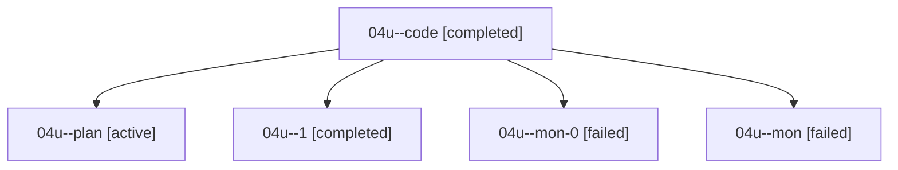

# Family: 04u

[Agent Hoods](../README.md) / [bbugyi200](../users/bbugyi200/README.md) / [athena](../users/bbugyi200/machines/athena/README.md) / [04u](../users/bbugyi200/machines/athena/hoods/04u/README.md) / 04u

Owner: `bbugyi200.athena` · Hood: `04u` · Members: 5

## Lineage

The diagram is an optional enhancement; the ordered table below contains the same lineage in accessible text.

| Role | Agent | State | Model / provider | Timing | Commits | Prompt | Chat |
|---|---|---|---|---|---:|---|---|
| code | 04u--code | completed | grok-4.6 / grok | 2026-08-17T15:01:45.460617+00:00 | 0 | — | [Chat](../agents/bbugyi200.athena.04u--code/chat.md) |
| plan | 04u--plan | active | opus / claude | 2026-08-17T14:38:58.349757+00:00 | 0 | [Prompt](../agents/bbugyi200.athena.04u--plan/prompt.md) | [Chat](../agents/bbugyi200.athena.04u--plan/chat.md) |
| 1 | 04u--1 | completed | grok-4.6 / grok | 2026-08-17T15:40:41.743827+00:00 | 0 | [Prompt](../agents/bbugyi200.athena.04u--1/prompt.md) | [Chat](../agents/bbugyi200.athena.04u--1/chat.md) |
| mon-0 | 04u--mon-0 | failed | grok-4.6 / grok | 2026-08-17T15:51:26.927456+00:00 | 0 | — | [Chat](../agents/bbugyi200.athena.04u--mon-0/chat.md) |
| mon | 04u--mon | failed | grok-4.6 / grok | 2026-08-17T15:24:57.016801+00:00 | 0 | — | [Chat](../agents/bbugyi200.athena.04u--mon/chat.md) |

## Commits

| Role | Repo | Commit | Subject | Committed |
|---|---|---|---|---|
| — | sase | [`67e33e6`](https://github.com/sase-org/sase/commit/67e33e6e23b4e4aba2cfbffed2296c4a8ef27ae5) | chore: Add SDD prompt and plan for auto\_approve\_menu\_and\_tale\_directive | 2026-06-23 18:31:48 EDT |
| — | sase | [`58ecb28`](https://github.com/sase-org/sase/commit/58ecb2830c0aebdea700c6be053c49b4374efe9c) | chore(beads): create auto-approve menu epic | 2026-06-23 18:40:03 EDT |

## Neighbors

| Agent | Relation | State |
|---|---|---|
| [04u.w0](../agents/bbugyi200.athena.04u.w0/README.md) | descendant | waiting |
