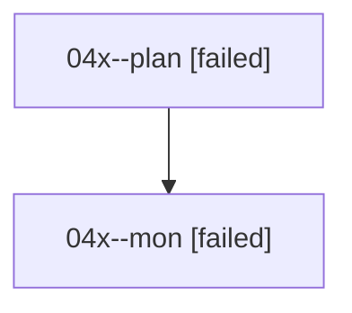

# Family: 04x

[Agent Hoods](../README.md) / [bbugyi200](../users/bbugyi200/README.md) / [athena](../users/bbugyi200/machines/athena/README.md) / [04x](../users/bbugyi200/machines/athena/hoods/04x/README.md) / 04x

Owner: `bbugyi200.athena` · Hood: `04x` · Members: 2

## Lineage

The diagram is an optional enhancement; the ordered table below contains the same lineage in accessible text.

| Role | Agent | State | Model / provider | Timing | Commits | Prompt | Chat |
|---|---|---|---|---|---:|---|---|
| plan | 04x--plan | failed | opus / claude | 2026-08-17T15:33:01.872674+00:00 | 0 | [Prompt](../agents/bbugyi200.athena.04x--plan/prompt.md) | [Chat](../agents/bbugyi200.athena.04x--plan/chat.md) |
| mon | 04x--mon | failed | opus / claude | 2026-08-17T15:47:51.460962+00:00 | 0 | — | [Chat](../agents/bbugyi200.athena.04x--mon/chat.md) |

## Commits

| Role | Repo | Commit | Subject | Committed |
|---|---|---|---|---|
| — | sase | [`2f63f8c`](https://github.com/sase-org/sase/commit/2f63f8c0a83ca958aaea32b20f7189f05f9a7dfd) | chore: Add SDD prompt and plan for prompt\_vim\_cursor\_highlight | 2026-06-24 10:50:13 UTC |
| — | sase | [`2ab68db`](https://github.com/sase-org/sase/commit/2ab68dbb54957e2c110436da97cf5665fcae0376) | feat(tui): color vim prompt cursor by mode | 2026-06-24 11:07:43 UTC |
