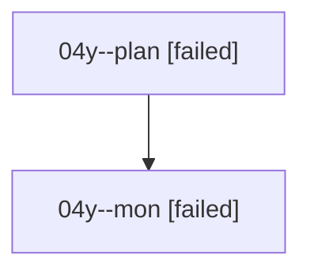

# Family: 04y

[Agent Hoods](../README.md) / [bbugyi200](../users/bbugyi200/README.md) / [athena](../users/bbugyi200/machines/athena/README.md) / [04y](../users/bbugyi200/machines/athena/hoods/04y/README.md) / 04y

Owner: `bbugyi200.athena` · Hood: `04y` · Members: 2

## Lineage

The diagram is an optional enhancement; the ordered table below contains the same lineage in accessible text.

| Role | Agent | State | Model / provider | Timing | Commits | Prompt | Chat |
|---|---|---|---|---|---:|---|---|
| plan | 04y--plan | failed | opus / claude | 2026-08-17T15:38:12.237576+00:00 | 0 | [Prompt](../agents/bbugyi200.athena.04y--plan/prompt.md) | [Chat](../agents/bbugyi200.athena.04y--plan/chat.md) |
| mon | 04y--mon | failed | opus / claude | 2026-08-17T16:01:53.766544+00:00 | 0 | — | [Chat](../agents/bbugyi200.athena.04y--mon/chat.md) |

## Commits

| Role | Repo | Commit | Subject | Committed |
|---|---|---|---|---|
| — | sase | [`c0ec6ac`](https://github.com/sase-org/sase/commit/c0ec6acb4dfac9ba8731b43a7135444786a091c9) | chore: Add SDD prompt and plan for fix\_rust\_fmt\_check\_directive | 2026-06-24 10:41:17 UTC |
| — | sase | [`6c70142`](https://github.com/sase-org/sase/commit/6c70142c4706b6ccc2bb42c716d54ade12e24f01) | chore: Mark SDD plan done | 2026-06-24 11:47:47 UTC |
