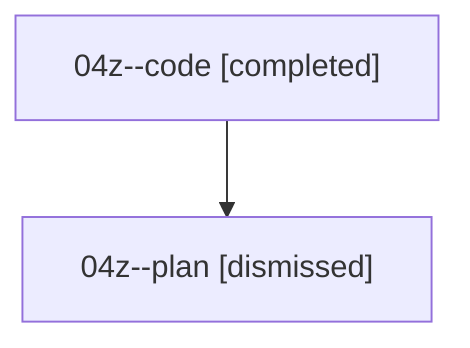

# Family: 04z

[Agent Hoods](../README.md) / [bbugyi200](../users/bbugyi200/README.md) / [athena](../users/bbugyi200/machines/athena/README.md) / [04z](../users/bbugyi200/machines/athena/hoods/04z/README.md) / 04z

Owner: `bbugyi200.athena` · Hood: `04z` · Members: 2

## Lineage

The diagram is an optional enhancement; the ordered table below contains the same lineage in accessible text.

| Role | Agent | State | Model / provider | Timing | Commits | Prompt | Chat |
|---|---|---|---|---|---:|---|---|
| code | 04z--code | completed | sonnet / claude | 2026-08-17T15:59:23.171842+00:00 | [1](../agents/bbugyi200.athena.04z--code/README.md#commits) | — | [Chat](../agents/bbugyi200.athena.04z--code/chat.md) |
| plan | 04z--plan | dismissed | — | 2026-08-17T11:43:33 | 0 | — | — |

## Commits

| Role | Repo | Commit | Subject | Committed |
|---|---|---|---|---|
| code | sase | [`c4a29f2`](https://github.com/sase-org/sase/commit/c4a29f213ff24ee5766f7d0198c614143cb957c8) | fix(ace-tui): restore unread markers for plan-family agent nodes | 2026-08-17 12:08:54 EDT |
