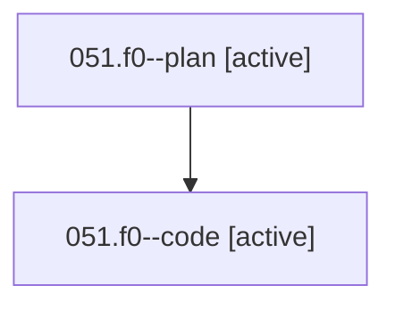

# Family: 051.f0

[Agent Hoods](../README.md) / [bbugyi200](../users/bbugyi200/README.md) / [athena](../users/bbugyi200/machines/athena/README.md) / [051](../users/bbugyi200/machines/athena/hoods/051/README.md) / 051.f0

Owner: `bbugyi200.athena` · Hood: `051` · Members: 2

## Lineage

The diagram is an optional enhancement; the ordered table below contains the same lineage in accessible text.

| Role | Agent | State | Model / provider | Timing | Commits | Prompt | Chat |
|---|---|---|---|---|---:|---|---|
| plan | 051.f0--plan | active | opus / claude | 2026-08-17T16:37:26.487038+00:00 | 0 | [Prompt](../agents/bbugyi200.athena.051.f0--plan/prompt.md) | [Chat](../agents/bbugyi200.athena.051.f0--plan/chat.md) |
| code | 051.f0--code | active | grok-4.6 / grok | 2026-08-17T16:53:51.738212+00:00 | 0 | — | — |

## Neighbors

| Agent | Relation | State |
|---|---|---|
| [051](../agents/bbugyi200.athena.051/README.md) | ancestor | completed |
