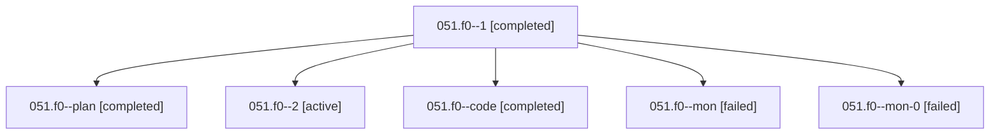

# Family: 051.f0

[Agent Hoods](../README.md) / [bbugyi200](../users/bbugyi200/README.md) / [athena](../users/bbugyi200/machines/athena/README.md) / [051](../users/bbugyi200/machines/athena/hoods/051/README.md) / 051.f0

Owner: `bbugyi200.athena` · Hood: `051` · Members: 6

## Lineage

The diagram is an optional enhancement; the ordered table below contains the same lineage in accessible text.

| Role | Agent | State | Model / provider | Timing | Commits | Prompt | Chat |
|---|---|---|---|---|---:|---|---|
| 1 | 051.f0--1 | completed | grok-4.6 / grok | 2026-08-17T18:23:46.081454+00:00 | 0 | [Prompt](../agents/bbugyi200.athena.051.f0--1/prompt.md) | [Chat](../agents/bbugyi200.athena.051.f0--1/chat.md) |
| plan | 051.f0--plan | completed | opus / claude | 2026-08-17T16:37:26.487038+00:00 | 0 | [Prompt](../agents/bbugyi200.athena.051.f0--plan/prompt.md) | [Chat](../agents/bbugyi200.athena.051.f0--plan/chat.md) |
| 2 | 051.f0--2 | active | grok-4.6 / grok | 2026-08-17T18:35:33.193990+00:00 | [1](../agents/bbugyi200.athena.051.f0--2/README.md#commits) | [Prompt](../agents/bbugyi200.athena.051.f0--2/prompt.md) | — |
| code | 051.f0--code | completed | grok-4.6 / grok | 2026-08-17T16:53:51.738212+00:00 | 0 | — | [Chat](../agents/bbugyi200.athena.051.f0--code/chat.md) |
| mon | 051.f0--mon | failed | grok-4.6 / grok | 2026-08-17T17:38:18.802628+00:00 | 0 | — | [Chat](../agents/bbugyi200.athena.051.f0--mon/chat.md) |
| mon-0 | 051.f0--mon-0 | failed | grok-4.6 / grok | 2026-08-17T18:32:17.002297+00:00 | 0 | — | [Chat](../agents/bbugyi200.athena.051.f0--mon-0/chat.md) |

## Commits

| Role | Repo | Commit | Subject | Committed |
|---|---|---|---|---|
| 2 | sase | [`f5565ed`](https://github.com/sase-org/sase/commit/f5565eddafb9a04be49b17c7b5dbe4182fee0bfc) | feat(cli): add root -f/--enable-feature and -F/--disable-feature options | 2026-08-17 14:39:18 EDT |

## Neighbors

| Agent | Relation | State |
|---|---|---|
| [051](../agents/bbugyi200.athena.051/README.md) | ancestor | completed |
