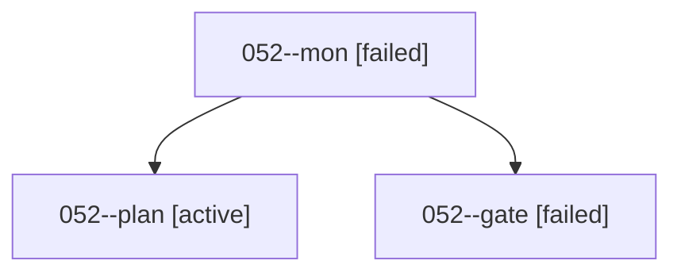

# Family: 052

[Agent Hoods](../README.md) / [bbugyi200](../users/bbugyi200/README.md) / [athena](../users/bbugyi200/machines/athena/README.md) / [052](../users/bbugyi200/machines/athena/hoods/052/README.md) / 052

Owner: `bbugyi200.athena` · Hood: `052` · Members: 3

## Lineage

The diagram is an optional enhancement; the ordered table below contains the same lineage in accessible text.

| Role | Agent | State | Model / provider | Timing | Commits | Prompt | Chat |
|---|---|---|---|---|---:|---|---|
| mon | 052--mon | failed | gpt-6-astra / codex | 2026-09-07T20:09:11.571829+00:00 → 2026-09-07T20:13:45.839787+00:00 | 0 | — | [Chat](../agents/bbugyi200.athena.052--mon/chat.md) |
| plan | 052--plan | active | gpt-6-astra / codex | 2026-09-07T19:52:32.773363+00:00 | 0 | [Prompt](../agents/bbugyi200.athena.052--plan/prompt.md) | [Chat](../agents/bbugyi200.athena.052--plan/chat.md) |
| gate | 052--gate | failed | gpt-6-astra / codex | 2026-09-07T20:08:31.439662+00:00 → 2026-09-07T20:09:13.137982+00:00 | 0 | — | [Chat](../agents/bbugyi200.athena.052--gate/chat.md) |

## Commits

| Role | Repo | Commit | Subject | Committed |
|---|---|---|---|---|
| — | sase | [`7d2c099`](https://github.com/sase-org/sase/commit/7d2c099fdf84fb6b75c831a46681a320558f9f00) | chore: Add SDD prompt and plan for fix\_followup\_agent\_default\_effort | 2026-06-24 07:15:44 EDT |
| — | sase | [`06bfa10`](https://github.com/sase-org/sase/commit/06bfa1070a65b4fa8f8b63e52d95117f3dbbd796) | fix: persist follow-up reasoning effort | 2026-06-24 07:29:04 EDT |
