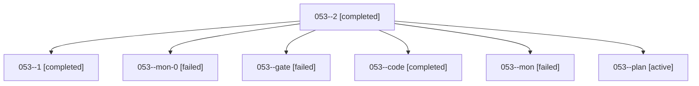

# Family: 053

[Agent Hoods](../README.md) / [bbugyi200](../users/bbugyi200/README.md) / [athena](../users/bbugyi200/machines/athena/README.md) / [053](../users/bbugyi200/machines/athena/hoods/053/README.md) / 053

Owner: `bbugyi200.athena` · Hood: `053` · Members: 7

## Lineage

The diagram is an optional enhancement; the ordered table below contains the same lineage in accessible text.

| Role | Agent | State | Model / provider | Timing | Commits | Prompt | Chat |
|---|---|---|---|---|---:|---|---|
| 2 | 053--2 | completed | grok-4.6 / grok | 2026-09-07T20:27:32.001002+00:00 → 2026-09-07T20:34:31.606010+00:00 | 0 | [Prompt](../agents/bbugyi200.athena.053--2/prompt.md) | [Chat](../agents/bbugyi200.athena.053--2/chat.md) |
| 1 | 053--1 | completed | grok-4.6 / grok | 2026-09-07T20:15:14.247270+00:00 → 2026-09-07T20:20:00.564809+00:00 | 0 | [Prompt](../agents/bbugyi200.athena.053--1/prompt.md) | [Chat](../agents/bbugyi200.athena.053--1/chat.md) |
| mon-0 | 053--mon-0 | failed | grok-4.6 / grok | 2026-09-07T20:19:52.113313+00:00 → 2026-09-07T20:27:04.697569+00:00 | 0 | — | [Chat](../agents/bbugyi200.athena.053--mon-0/chat.md) |
| gate | 053--gate | failed | gpt-5.6-sol / codex | 2026-09-07T20:04:02.274272+00:00 → 2026-09-07T20:05:48.123145+00:00 | 0 | — | [Chat](../agents/bbugyi200.athena.053--gate/chat.md) |
| code | 053--code | completed | grok-4.6 / grok | 2026-09-07T20:05:55.593371+00:00 → 2026-09-07T20:10:05.252719+00:00 | 0 | [Prompt](../agents/bbugyi200.athena.053--code/prompt.md) | [Chat](../agents/bbugyi200.athena.053--code/chat.md) |
| mon | 053--mon | failed | grok-4.6 / grok | 2026-09-07T20:09:55.497971+00:00 → 2026-09-07T20:14:48.635992+00:00 | 0 | — | [Chat](../agents/bbugyi200.athena.053--mon/chat.md) |
| plan | 053--plan | active | gpt-5.6-sol / codex | 2026-09-07T19:58:59.790220+00:00 | 0 | [Prompt](../agents/bbugyi200.athena.053--plan/prompt.md) | [Chat](../agents/bbugyi200.athena.053--plan/chat.md) |

## Commits

| Role | Repo | Commit | Subject | Committed |
|---|---|---|---|---|
| — | sase | [`bc36d2a`](https://github.com/sase-org/sase/commit/bc36d2aa3e8d7b020bba673ffff00b0073666fa7) | chore: Add SDD prompt and plan for archive\_git\_worktree\_delete | 2026-06-24 07:05:47 EDT |
| — | sase | [`988bd32`](https://github.com/sase-org/sase/commit/988bd32f17d32092c7369c450159f4a41216e669) | fix(vcs): archive branch safely from a checked-out worktree | 2026-06-24 07:14:29 EDT |
