# Family: 054

[Agent Hoods](../README.md) / [bbugyi200](../users/bbugyi200/README.md) / [athena](../users/bbugyi200/machines/athena/README.md) / [054](../users/bbugyi200/machines/athena/hoods/054/README.md) / 054

Owner: `bbugyi200.athena` · Hood: `054` · Members: 22

## Lineage

```mermaid
flowchart TD
  n0["054--4 [completed]"]
  n1["054--mon [failed]"]
  n0 --> n1
  n2["054--7 [completed]"]
  n0 --> n2
  n3["054--mon-1 [failed]"]
  n0 --> n3
  n4["054--5 [completed]"]
  n0 --> n4
  n5["054--1 [completed]"]
  n0 --> n5
  n6["054--mon-2 [failed]"]
  n0 --> n6
  n7["054--mon-8 [failed]"]
  n0 --> n7
  n8["054--mon-6 [failed]"]
  n0 --> n8
  n9["054--6 [completed]"]
  n0 --> n9
  n10["054--mon-7 [failed]"]
  n0 --> n10
  n11["054--mon-4 [failed]"]
  n0 --> n11
  n12["054--2 [completed]"]
  n0 --> n12
  n13["054--8 [completed]"]
  n0 --> n13
  n14["054--code [completed]"]
  n0 --> n14
  n15["054--3 [completed]"]
  n0 --> n15
  n16["054--9 [completed]"]
  n0 --> n16
  n17["054--a [active]"]
  n0 --> n17
  n18["054--plan [completed]"]
  n0 --> n18
  n19["054--mon-5 [failed]"]
  n0 --> n19
  n20["054--mon-0 [failed]"]
  n0 --> n20
  n21["054--mon-3 [failed]"]
  n0 --> n21
```

The diagram is an optional enhancement; the ordered table below contains the same lineage in accessible text.

| Role | Agent | State | Model / provider | Timing | Commits | Prompt | Chat |
|---|---|---|---|---|---:|---|---|
| 4 | 054--4 | completed | sonnet / claude | 2026-08-17T18:14:48.034313+00:00 | 0 | [Prompt](../agents/bbugyi200.athena.054--4/prompt.md) | [Chat](../agents/bbugyi200.athena.054--4/chat.md) |
| mon | 054--mon | failed | sonnet / claude | 2026-08-17T17:51:39.119650+00:00 | 0 | — | [Chat](../agents/bbugyi200.athena.054--mon/chat.md) |
| 7 | 054--7 | completed | sonnet / claude | 2026-08-17T18:44:27.725348+00:00 | 0 | [Prompt](../agents/bbugyi200.athena.054--7/prompt.md) | [Chat](../agents/bbugyi200.athena.054--7/chat.md) |
| mon-1 | 054--mon-1 | failed | sonnet / claude | 2026-08-17T17:58:23.726619+00:00 | 0 | — | [Chat](../agents/bbugyi200.athena.054--mon-1/chat.md) |
| 5 | 054--5 | completed | sonnet / claude | 2026-08-17T18:19:05.645877+00:00 | 0 | [Prompt](../agents/bbugyi200.athena.054--5/prompt.md) | [Chat](../agents/bbugyi200.athena.054--5/chat.md) |
| 1 | 054--1 | completed | sonnet / claude | 2026-08-17T17:52:18.495676+00:00 | 0 | [Prompt](../agents/bbugyi200.athena.054--1/prompt.md) | [Chat](../agents/bbugyi200.athena.054--1/chat.md) |
| mon-2 | 054--mon-2 | failed | sonnet / claude | 2026-08-17T18:14:08.584033+00:00 | 0 | — | [Chat](../agents/bbugyi200.athena.054--mon-2/chat.md) |
| mon-8 | 054--mon-8 | failed | sonnet / claude | 2026-08-17T18:56:40.158906+00:00 | 0 | — | [Chat](../agents/bbugyi200.athena.054--mon-8/chat.md) |
| mon-6 | 054--mon-6 | failed | sonnet / claude | 2026-08-17T18:45:46.918113+00:00 | 0 | — | [Chat](../agents/bbugyi200.athena.054--mon-6/chat.md) |
| 6 | 054--6 | completed | sonnet / claude | 2026-08-17T18:23:35.339111+00:00 | 0 | [Prompt](../agents/bbugyi200.athena.054--6/prompt.md) | [Chat](../agents/bbugyi200.athena.054--6/chat.md) |
| mon-7 | 054--mon-7 | failed | sonnet / claude | 2026-08-17T18:49:59.000057+00:00 | 0 | — | [Chat](../agents/bbugyi200.athena.054--mon-7/chat.md) |
| mon-4 | 054--mon-4 | failed | sonnet / claude | 2026-08-17T18:20:42.281911+00:00 | 0 | — | [Chat](../agents/bbugyi200.athena.054--mon-4/chat.md) |
| 2 | 054--2 | completed | sonnet / claude | 2026-08-17T17:56:14.216137+00:00 | 0 | [Prompt](../agents/bbugyi200.athena.054--2/prompt.md) | [Chat](../agents/bbugyi200.athena.054--2/chat.md) |
| 8 | 054--8 | completed | sonnet / claude | 2026-08-17T18:48:34.974783+00:00 | 0 | [Prompt](../agents/bbugyi200.athena.054--8/prompt.md) | [Chat](../agents/bbugyi200.athena.054--8/chat.md) |
| code | 054--code | completed | sonnet / claude | 2026-08-17T17:33:53.476118+00:00 | 0 | — | [Chat](../agents/bbugyi200.athena.054--code/chat.md) |
| 3 | 054--3 | completed | sonnet / claude | 2026-08-17T18:12:21.877752+00:00 | 0 | [Prompt](../agents/bbugyi200.athena.054--3/prompt.md) | [Chat](../agents/bbugyi200.athena.054--3/chat.md) |
| 9 | 054--9 | completed | sonnet / claude | 2026-08-17T18:55:06.737897+00:00 | 0 | [Prompt](../agents/bbugyi200.athena.054--9/prompt.md) | [Chat](../agents/bbugyi200.athena.054--9/chat.md) |
| a | 054--a | active | sonnet / claude | 2026-08-17T19:01:38.162966+00:00 | [1](../agents/bbugyi200.athena.054--a/README.md#commits) | [Prompt](../agents/bbugyi200.athena.054--a/prompt.md) | — |
| plan | 054--plan | completed | opus / claude | 2026-08-17T17:17:34.650381+00:00 | 0 | [Prompt](../agents/bbugyi200.athena.054--plan/prompt.md) | [Chat](../agents/bbugyi200.athena.054--plan/chat.md) |
| mon-5 | 054--mon-5 | failed | sonnet / claude | 2026-08-17T18:24:55.630402+00:00 | 0 | — | [Chat](../agents/bbugyi200.athena.054--mon-5/chat.md) |
| mon-0 | 054--mon-0 | failed | sonnet / claude | 2026-08-17T17:53:02.590381+00:00 | 0 | — | [Chat](../agents/bbugyi200.athena.054--mon-0/chat.md) |
| mon-3 | 054--mon-3 | failed | sonnet / claude | 2026-08-17T18:15:36.502572+00:00 | 0 | — | [Chat](../agents/bbugyi200.athena.054--mon-3/chat.md) |

## Commits

| Role | Repo | Commit | Subject | Committed |
|---|---|---|---|---|
| — | sase | [`b4b802a`](https://github.com/sase-org/sase/commit/b4b802a37ae1af5fa5dd96cda5bf6e028071ad5c) | chore: Add SDD prompt and plan for fix\_release\_please\_bad\_credentials | 2026-06-24 07:25:20 EDT |
| — | sase | [`8b6ceb1`](https://github.com/sase-org/sase/commit/8b6ceb1b3d5186025c7dce9bd1a16fa01c43c3ea) | ci: retry release-please publish workflow | 2026-06-24 07:30:28 EDT |
| a | sase | [`dc4ca20`](https://github.com/sase-org/sase/commit/dc4ca2057a629e006ec6fa8a9810a3db8de5a08a) | fix(agent): restore forced agent-name-reuse launches for Agents-tab \`,x\` kill-and-edit | 2026-08-17 15:02:43 EDT |
