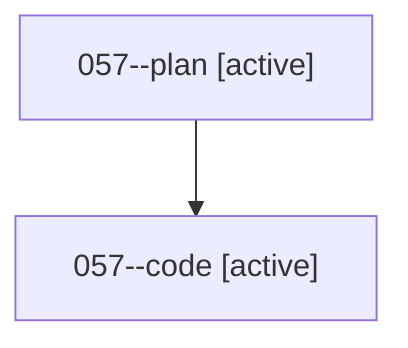

# Family: 057

[Agent Hoods](../README.md) / [bbugyi200](../users/bbugyi200/README.md) / [athena](../users/bbugyi200/machines/athena/README.md) / [057](../users/bbugyi200/machines/athena/hoods/057/README.md) / 057

Owner: `bbugyi200.athena` · Hood: `057` · Members: 2

## Lineage

The diagram is an optional enhancement; the ordered table below contains the same lineage in accessible text.

| Role | Agent | State | Model / provider | Timing | Commits | Prompt | Chat |
|---|---|---|---|---|---:|---|---|
| plan | 057--plan | active | opus / claude | 2026-08-17T21:37:02.109396+00:00 | 0 | [Prompt](../agents/bbugyi200.athena.057--plan/prompt.md) | [Chat](../agents/bbugyi200.athena.057--plan/chat.md) |
| code | 057--code | active | sonnet / claude | 2026-08-17T21:47:02.773287+00:00 | [1](../agents/bbugyi200.athena.057--code/README.md#commits) | — | — |

## Commits

| Role | Repo | Commit | Subject | Committed |
|---|---|---|---|---|
| — | sase | [`0a043b3`](https://github.com/sase-org/sase/commit/0a043b3466e070419f2689938afb4d306d1e60ff) | chore: Add SDD prompt and plan for ctrl\_s\_stash\_prompt | 2026-06-24 11:54:42 UTC |
| — | sase | [`b81437a`](https://github.com/sase-org/sase/commit/b81437a8b4198f2197e1889ebd43e267319dea16) | feat!: rebind prompt stash shortcuts | 2026-06-24 12:11:22 UTC |
| code | sase | [`c89e5bb`](https://github.com/sase-org/sase/commit/c89e5bbebfe03117565e80daaab20527354247d3) | feat(ace): collapse Artifacts relation panel by default behind a self-explaining rail | 2026-08-17 22:42:58 UTC |
