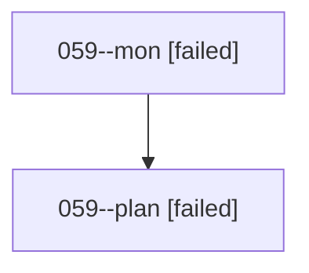

# Family: 059

[Agent Hoods](../README.md) / [bbugyi200](../users/bbugyi200/README.md) / [athena](../users/bbugyi200/machines/athena/README.md) / [059](../users/bbugyi200/machines/athena/hoods/059/README.md) / 059

Owner: `bbugyi200.athena` · Hood: `059` · Members: 2

## Lineage

The diagram is an optional enhancement; the ordered table below contains the same lineage in accessible text.

| Role | Agent | State | Model / provider | Timing | Commits | Prompt | Chat |
|---|---|---|---|---|---:|---|---|
| mon | 059--mon | failed | opus / claude | 2026-08-17T22:09:11.724555+00:00 | 0 | — | [Chat](../agents/bbugyi200.athena.059--mon/chat.md) |
| plan | 059--plan | failed | opus / claude | 2026-08-17T21:42:23.499407+00:00 | 0 | [Prompt](../agents/bbugyi200.athena.059--plan/prompt.md) | [Chat](../agents/bbugyi200.athena.059--plan/chat.md) |
