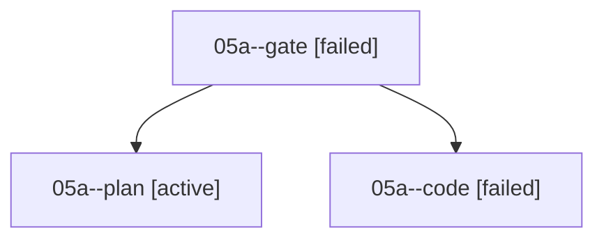

# Family: 05a

[Agent Hoods](../README.md) / [bbugyi200](../users/bbugyi200/README.md) / [athena](../users/bbugyi200/machines/athena/README.md) / [05a](../users/bbugyi200/machines/athena/hoods/05a/README.md) / 05a

Owner: `bbugyi200.athena` · Hood: `05a` · Members: 3

## Lineage

The diagram is an optional enhancement; the ordered table below contains the same lineage in accessible text.

| Role | Agent | State | Model / provider | Timing | Commits | Prompt | Chat |
|---|---|---|---|---|---:|---|---|
| gate | 05a--gate | failed | claude-fable-5 / claude | 2026-09-07T20:19:54.971819+00:00 → 2026-09-07T20:24:22.276485+00:00 | 0 | — | [Chat](../agents/bbugyi200.athena.05a--gate/chat.md) |
| plan | 05a--plan | active | claude-fable-5 / claude | 2026-09-07T20:08:25.650042+00:00 | 0 | [Prompt](../agents/bbugyi200.athena.05a--plan/prompt.md) | [Chat](../agents/bbugyi200.athena.05a--plan/chat.md) |
| code | 05a--code | failed | grok-4.6 / grok | 2026-09-07T20:24:30.622757+00:00 → 2026-09-07T22:22:11.353480+00:00 | 0 | [Prompt](../agents/bbugyi200.athena.05a--code/prompt.md) | — |

## Commits

| Role | Repo | Commit | Subject | Committed |
|---|---|---|---|---|
| — | sase | [`617f76e`](https://github.com/sase-org/sase/commit/617f76effdf37da457f29eea31a70dba5147d257) | chore: Add SDD prompt and plan for blank\_line\_keymaps | 2026-06-24 08:48:27 EDT |
| — | sase | [`3acbe8a`](https://github.com/sase-org/sase/commit/3acbe8ae1e71c1cf1ce54c223bb5c07ade99ab1e) | feat(ace): add blank-line normal-mode keymaps | 2026-06-24 08:58:01 EDT |

## Neighbors

| Agent | Relation | State |
|---|---|---|
| [05a.f0](../agents/bbugyi200.athena.05a.f0/README.md) | descendant | waiting |
