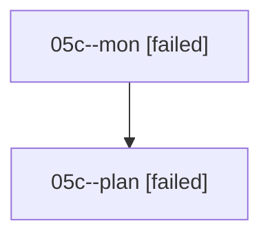

# Family: 05c

[Agent Hoods](../README.md) / [bbugyi200](../users/bbugyi200/README.md) / [athena](../users/bbugyi200/machines/athena/README.md) / [05c](../users/bbugyi200/machines/athena/hoods/05c/README.md) / 05c

Owner: `bbugyi200.athena` · Hood: `05c` · Members: 2

## Lineage

The diagram is an optional enhancement; the ordered table below contains the same lineage in accessible text.

| Role | Agent | State | Model / provider | Timing | Commits | Prompt | Chat |
|---|---|---|---|---|---:|---|---|
| mon | 05c--mon | failed | opus / claude | 2026-08-17T22:49:58.547313+00:00 | 0 | — | [Chat](../agents/bbugyi200.athena.05c--mon/chat.md) |
| plan | 05c--plan | failed | opus / claude | 2026-08-17T22:24:33.642764+00:00 | 0 | [Prompt](../agents/bbugyi200.athena.05c--plan/prompt.md) | [Chat](../agents/bbugyi200.athena.05c--plan/chat.md) |

## Commits

| Role | Repo | Commit | Subject | Committed |
|---|---|---|---|---|
| — | sase | [`e20713c`](https://github.com/sase-org/sase/commit/e20713c91c2e0fa95ad5bc15aa3e485daaeb666b) | chore: Add SDD prompt and plan for move\_pencil\_before\_runtime | 2026-06-24 09:00:31 EDT |
| — | sase | [`825c70b`](https://github.com/sase-org/sase/commit/825c70b8a8edb7ae0cf9f46cff88e45e0aa1ad0c) | fix(ace): render file-change glyph before runtime suffix | 2026-06-24 09:13:05 EDT |
