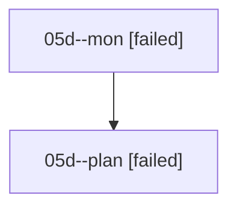

# Family: 05d

[Agent Hoods](../README.md) / [bbugyi200](../users/bbugyi200/README.md) / [athena](../users/bbugyi200/machines/athena/README.md) / [05d](../users/bbugyi200/machines/athena/hoods/05d/README.md) / 05d

Owner: `bbugyi200.athena` · Hood: `05d` · Members: 2

## Lineage

The diagram is an optional enhancement; the ordered table below contains the same lineage in accessible text.

| Role | Agent | State | Model / provider | Timing | Commits | Prompt | Chat |
|---|---|---|---|---|---:|---|---|
| mon | 05d--mon | failed | opus / claude | 2026-08-17T22:53:58.782489+00:00 | 0 | — | [Chat](../agents/bbugyi200.athena.05d--mon/chat.md) |
| plan | 05d--plan | failed | opus / claude | 2026-08-17T22:32:11.737882+00:00 | 0 | [Prompt](../agents/bbugyi200.athena.05d--plan/prompt.md) | [Chat](../agents/bbugyi200.athena.05d--plan/chat.md) |
