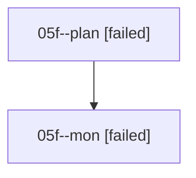

# Family: 05f

[Agent Hoods](../README.md) / [bbugyi200](../users/bbugyi200/README.md) / [athena](../users/bbugyi200/machines/athena/README.md) / [05f](../users/bbugyi200/machines/athena/hoods/05f/README.md) / 05f

Owner: `bbugyi200.athena` · Hood: `05f` · Members: 2

## Lineage

The diagram is an optional enhancement; the ordered table below contains the same lineage in accessible text.

| Role | Agent | State | Model / provider | Timing | Commits | Prompt | Chat |
|---|---|---|---|---|---:|---|---|
| plan | 05f--plan | failed | opus / claude | 2026-08-17T22:49:38.736459+00:00 | 0 | [Prompt](../agents/bbugyi200.athena.05f--plan/prompt.md) | [Chat](../agents/bbugyi200.athena.05f--plan/chat.md) |
| mon | 05f--mon | failed | opus / claude | 2026-08-17T23:00:48.452569+00:00 | 0 | — | [Chat](../agents/bbugyi200.athena.05f--mon/chat.md) |
