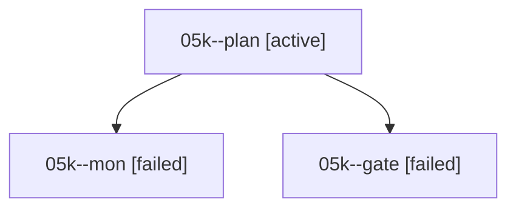

# Family: 05k

[Agent Hoods](../README.md) / [bbugyi200](../users/bbugyi200/README.md) / [athena](../users/bbugyi200/machines/athena/README.md) / [05k](../users/bbugyi200/machines/athena/hoods/05k/README.md) / 05k

Owner: `bbugyi200.athena` · Hood: `05k` · Members: 3

## Lineage

The diagram is an optional enhancement; the ordered table below contains the same lineage in accessible text.

| Role | Agent | State | Model / provider | Timing | Commits | Prompt | Chat |
|---|---|---|---|---|---:|---|---|
| plan | 05k--plan | active | claude-fable-5 / claude | 2026-09-07T20:47:53.701297+00:00 | 0 | [Prompt](../agents/bbugyi200.athena.05k--plan/prompt.md) | [Chat](../agents/bbugyi200.athena.05k--plan/chat.md) |
| mon | 05k--mon | failed | claude-fable-5 / claude | 2026-09-07T21:06:44.902666+00:00 → 2026-09-07T21:10:22.545954+00:00 | 0 | — | [Chat](../agents/bbugyi200.athena.05k--mon/chat.md) |
| gate | 05k--gate | failed | claude-fable-5 / claude | 2026-09-07T21:05:08.719449+00:00 → 2026-09-07T21:06:49.021308+00:00 | 0 | — | [Chat](../agents/bbugyi200.athena.05k--gate/chat.md) |

## Commits

| Role | Repo | Commit | Subject | Committed |
|---|---|---|---|---|
| — | sase | [`af0d95f`](https://github.com/sase-org/sase/commit/af0d95fe910f4ccbae4b00439296710fda5d6e46) | chore: Add SDD prompt and plan for cancel\_toast | 2026-06-24 12:18:48 EDT |
| — | sase | [`60776ae`](https://github.com/sase-org/sase/commit/60776ae601d7dc9b624298955e0810a9e460730a) | fix(tui): only toast saved cancelled prompts | 2026-06-24 12:27:26 EDT |
