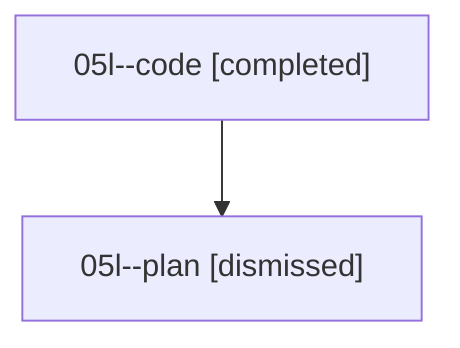

# Family: 05l

[Agent Hoods](../README.md) / [bbugyi200](../users/bbugyi200/README.md) / [athena](../users/bbugyi200/machines/athena/README.md) / [05l](../users/bbugyi200/machines/athena/hoods/05l/README.md) / 05l

Owner: `bbugyi200.athena` · Hood: `05l` · Members: 2

## Lineage

The diagram is an optional enhancement; the ordered table below contains the same lineage in accessible text.

| Role | Agent | State | Model / provider | Timing | Commits | Prompt | Chat |
|---|---|---|---|---|---:|---|---|
| code | 05l--code | completed | grok-4.6 / grok | 2026-08-18T10:40:42.319943+00:00 | [1](../agents/bbugyi200.athena.05l--code/README.md#commits) | — | [Chat](../agents/bbugyi200.athena.05l--code/chat.md) |
| plan | 05l--plan | dismissed | — | 2026-08-18T06:30:46 | 0 | — | — |

## Commits

| Role | Repo | Commit | Subject | Committed |
|---|---|---|---|---|
| — | sase | [`009a8b8`](https://github.com/sase-org/sase/commit/009a8b86113d905bc474372ef5d9eb10cc33231e) | chore: Add SDD prompt and plan for save\_marked\_agents\_background\_task | 2026-06-24 12:24:17 EDT |
| — | sase | [`10f43ed`](https://github.com/sase-org/sase/commit/10f43ed2a2e5048227ccab8f9153a303b60e9a4a) | perf(tui): track marked-agent save persistence | 2026-06-24 12:32:28 EDT |
| code | sase | [`e4319db`](https://github.com/sase-org/sase/commit/e4319dbb413845cd3bba73471dd6049ab16ddacc) | fix(glossary): infer project from numbered managed workspaces | 2026-08-18 06:55:51 EDT |
