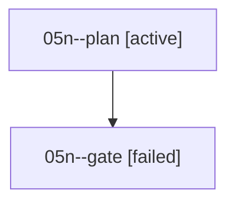

# Family: 05n

[Agent Hoods](../README.md) / [bbugyi200](../users/bbugyi200/README.md) / [athena](../users/bbugyi200/machines/athena/README.md) / [05n](../users/bbugyi200/machines/athena/hoods/05n/README.md) / 05n

Owner: `bbugyi200.athena` · Hood: `05n` · Members: 2

## Lineage

The diagram is an optional enhancement; the ordered table below contains the same lineage in accessible text.

| Role | Agent | State | Model / provider | Timing | Commits | Prompt | Chat |
|---|---|---|---|---|---:|---|---|
| plan | 05n--plan | active | claude-fable-5 / claude | 2026-09-07T21:06:43.411540+00:00 | 0 | [Prompt](../agents/bbugyi200.athena.05n--plan/prompt.md) | — |
| gate | 05n--gate | failed | claude-fable-5 / claude | 2026-09-07T21:27:53.298161+00:00 → 2026-09-07T21:27:55.007928+00:00 | 0 | — | [Chat](../agents/bbugyi200.athena.05n--gate/chat.md) |

## Commits

| Role | Repo | Commit | Subject | Committed |
|---|---|---|---|---|
| — | sase | [`256c299`](https://github.com/sase-org/sase/commit/256c299d473a8a0adb27da3ee2c8139514b4accd) | chore: Add SDD prompt and plan for unify\_auto\_directive | 2026-06-24 15:10:34 EDT |
| — | sase | [`36559c4`](https://github.com/sase-org/sase/commit/36559c4b7051ef1bdb42956bdfc2d9b36acd16b2) | feat!: unify auto approval directive | 2026-06-24 15:35:19 EDT |

## Neighbors

| Agent | Relation | State |
|---|---|---|
| [05n.w1](../agents/bbugyi200.athena.05n.w1/README.md) | descendant | completed |
| [05n.w1.f1](../agents/bbugyi200.athena.05n.w1.f1/README.md) | descendant | completed |
| [05n.w1.w1](../agents/bbugyi200.athena.05n.w1.w1/README.md) | descendant | completed |
| [05n.w1.w1.f1](../agents/bbugyi200.athena.05n.w1.w1.f1/README.md) | descendant | completed |
| [05n.w1.w1.f1.f1](../agents/bbugyi200.athena.05n.w1.w1.f1.f1/README.md) | descendant | completed |
