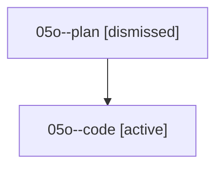

# Family: 05o

[Agent Hoods](../README.md) / [bbugyi200](../users/bbugyi200/README.md) / [athena](../users/bbugyi200/machines/athena/README.md) / [05o](../users/bbugyi200/machines/athena/hoods/05o/README.md) / 05o

Owner: `bbugyi200.athena` · Hood: `05o` · Members: 2

## Lineage

The diagram is an optional enhancement; the ordered table below contains the same lineage in accessible text.

| Role | Agent | State | Model / provider | Timing | Commits | Prompt | Chat |
|---|---|---|---|---|---:|---|---|
| plan | 05o--plan | dismissed | — | 2026-08-18T06:40:22 | 0 | — | — |
| code | 05o--code | active | grok-4.6 / grok | 2026-08-18T10:51:31.812563+00:00 | 0 | — | — |

## Commits

| Role | Repo | Commit | Subject | Committed |
|---|---|---|---|---|
| — | sase | [`68720ff`](https://github.com/sase-org/sase/commit/68720ff0b700ed33de26212e7b3e9952d1d28524) | feat: show multi-repo commit results in agents panel | 2026-06-24 19:24:19 UTC |
