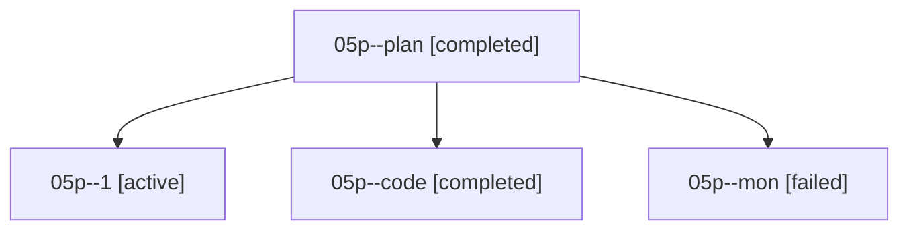

# Family: 05p

[Agent Hoods](../README.md) / [bbugyi200](../users/bbugyi200/README.md) / [athena](../users/bbugyi200/machines/athena/README.md) / [05p](../users/bbugyi200/machines/athena/hoods/05p/README.md) / 05p

Owner: `bbugyi200.athena` · Hood: `05p` · Members: 4

## Lineage

The diagram is an optional enhancement; the ordered table below contains the same lineage in accessible text.

| Role | Agent | State | Model / provider | Timing | Commits | Prompt | Chat |
|---|---|---|---|---|---:|---|---|
| plan | 05p--plan | completed | opus / claude | 2026-08-18T10:45:39.030948+00:00 | 0 | [Prompt](../agents/bbugyi200.athena.05p--plan/prompt.md) | [Chat](../agents/bbugyi200.athena.05p--plan/chat.md) |
| 1 | 05p--1 | active | sonnet / claude | 2026-08-18T11:12:36.555735+00:00 | [1](../agents/bbugyi200.athena.05p--1/README.md#commits) | [Prompt](../agents/bbugyi200.athena.05p--1/prompt.md) | — |
| code | 05p--code | completed | sonnet / claude | 2026-08-18T10:59:08.998745+00:00 | 0 | — | [Chat](../agents/bbugyi200.athena.05p--code/chat.md) |
| mon | 05p--mon | failed | sonnet / claude | 2026-08-18T11:09:57.067455+00:00 | 0 | — | [Chat](../agents/bbugyi200.athena.05p--mon/chat.md) |

## Commits

| Role | Repo | Commit | Subject | Committed |
|---|---|---|---|---|
| 1 | sase | [`134839e`](https://github.com/sase-org/sase/commit/134839e82d2e7c3963a7e4300bc7bdcd9b841e85) | fix(ace): fit the glossary panel's term rail to its widest row | 2026-08-18 11:21:09 UTC |
