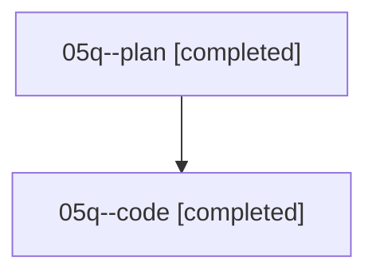

# Family: 05q

[Agent Hoods](../README.md) / [bbugyi200](../users/bbugyi200/README.md) / [athena](../users/bbugyi200/machines/athena/README.md) / [05q](../users/bbugyi200/machines/athena/hoods/05q/README.md) / 05q

Owner: `bbugyi200.athena` · Hood: `05q` · Members: 2

## Lineage

The diagram is an optional enhancement; the ordered table below contains the same lineage in accessible text.

| Role | Agent | State | Model / provider | Timing | Commits | Prompt | Chat |
|---|---|---|---|---|---:|---|---|
| plan | 05q--plan | completed | opus / claude | 2026-08-18T11:11:34.612421+00:00 | 0 | [Prompt](../agents/bbugyi200.athena.05q--plan/prompt.md) | [Chat](../agents/bbugyi200.athena.05q--plan/chat.md) |
| code | 05q--code | completed | sonnet / claude | 2026-08-18T11:24:36.814128+00:00 | [1](../agents/bbugyi200.athena.05q--code/README.md#commits) | — | [Chat](../agents/bbugyi200.athena.05q--code/chat.md) |

## Commits

| Role | Repo | Commit | Subject | Committed |
|---|---|---|---|---|
| code | sase | [`cbed335`](https://github.com/sase-org/sase/commit/cbed33584ee4ef71e8fc355038ffe7ef4ee3b0a5) | fix(amd): move the Tier 2 reference-material paragraph under Long-Term Memory Files | 2026-08-18 07:39:41 EDT |
