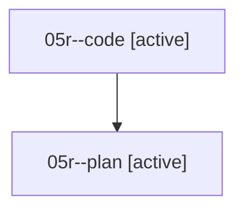

# Family: 05r

[Agent Hoods](../README.md) / [bbugyi200](../users/bbugyi200/README.md) / [athena](../users/bbugyi200/machines/athena/README.md) / [05r](../users/bbugyi200/machines/athena/hoods/05r/README.md) / 05r

Owner: `bbugyi200.athena` · Hood: `05r` · Members: 2

## Lineage

The diagram is an optional enhancement; the ordered table below contains the same lineage in accessible text.

| Role | Agent | State | Model / provider | Timing | Commits | Prompt | Chat |
|---|---|---|---|---|---:|---|---|
| code | 05r--code | active | sonnet / claude | 2026-08-18T11:20:54.485899+00:00 | [1](../agents/bbugyi200.athena.05r--code/README.md#commits) | — | — |
| plan | 05r--plan | active | opus / claude | 2026-08-18T11:13:19.389404+00:00 | 0 | [Prompt](../agents/bbugyi200.athena.05r--plan/prompt.md) | [Chat](../agents/bbugyi200.athena.05r--plan/chat.md) |

## Commits

| Role | Repo | Commit | Subject | Committed |
|---|---|---|---|---|
| code | sase | [`ebd3ffa`](https://github.com/sase-org/sase/commit/ebd3ffa72e8df72a64f2df0fdb19e868f100936e) | fix(ace): make NORMAL-mode Y yank from the cursor to end of line | 2026-08-18 07:39:03 EDT |
