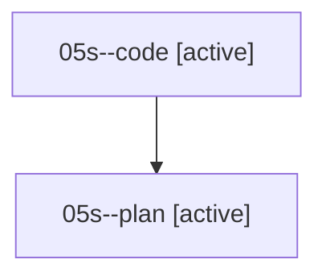

# Family: 05s

[Agent Hoods](../README.md) / [bbugyi200](../users/bbugyi200/README.md) / [athena](../users/bbugyi200/machines/athena/README.md) / [05s](../users/bbugyi200/machines/athena/hoods/05s/README.md) / 05s

Owner: `bbugyi200.athena` · Hood: `05s` · Members: 2

## Lineage

The diagram is an optional enhancement; the ordered table below contains the same lineage in accessible text.

| Role | Agent | State | Model / provider | Timing | Commits | Prompt | Chat |
|---|---|---|---|---|---:|---|---|
| code | 05s--code | active | sonnet / claude | 2026-08-18T11:26:40.167667+00:00 | [1](../agents/bbugyi200.athena.05s--code/README.md#commits) | — | — |
| plan | 05s--plan | active | opus / claude | 2026-08-18T11:17:25.122926+00:00 | 0 | [Prompt](../agents/bbugyi200.athena.05s--plan/prompt.md) | [Chat](../agents/bbugyi200.athena.05s--plan/chat.md) |

## Commits

| Role | Repo | Commit | Subject | Committed |
|---|---|---|---|---|
| — | sase | [`d8f60e7`](https://github.com/sase-org/sase/commit/d8f60e729c54fae373e0f232fa79a2c39cd71561) | chore: Add SDD prompt and plan for update\_pinned\_prompt\_stash | 2026-06-25 11:28:45 UTC |
| — | sase | [`a439daf`](https://github.com/sase-org/sase/commit/a439daf2f52d2fb1987f45e6bc113c8372f32dfc) | feat(tui): update pinned prompt stash | 2026-06-25 11:48:58 UTC |
| code | sase | [`9d6d48c`](https://github.com/sase-org/sase/commit/9d6d48c1b883e0c00e94a9080c7c396608720c71) | feat(memory): add \`sase memory show\` and share resolve/render logic with \`read\` | 2026-08-18 11:55:41 UTC |
