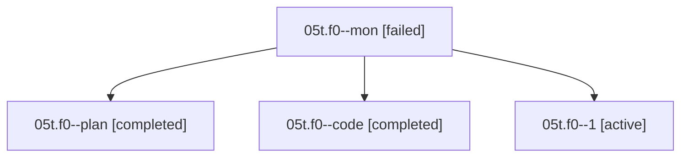

# Family: 05t.f0

[Agent Hoods](../README.md) / [bbugyi200](../users/bbugyi200/README.md) / [athena](../users/bbugyi200/machines/athena/README.md) / [05t](../users/bbugyi200/machines/athena/hoods/05t/README.md) / 05t.f0

Owner: `bbugyi200.athena` · Hood: `05t` · Members: 4

## Lineage

The diagram is an optional enhancement; the ordered table below contains the same lineage in accessible text.

| Role | Agent | State | Model / provider | Timing | Commits | Prompt | Chat |
|---|---|---|---|---|---:|---|---|
| mon | 05t.f0--mon | failed | grok-4.6 / grok | 2026-08-18T14:12:29.869581+00:00 | 0 | — | [Chat](../agents/bbugyi200.athena.05t.f0--mon/chat.md) |
| plan | 05t.f0--plan | completed | opus / claude | 2026-08-18T13:34:34.819244+00:00 | 0 | [Prompt](../agents/bbugyi200.athena.05t.f0--plan/prompt.md) | [Chat](../agents/bbugyi200.athena.05t.f0--plan/chat.md) |
| code | 05t.f0--code | completed | grok-4.6 / grok | 2026-08-18T13:42:05.713204+00:00 | 0 | — | [Chat](../agents/bbugyi200.athena.05t.f0--code/chat.md) |
| 1 | 05t.f0--1 | active | grok-4.6 / grok | 2026-08-18T14:28:14.319097+00:00 | [1](../agents/bbugyi200.athena.05t.f0--1/README.md#commits) | [Prompt](../agents/bbugyi200.athena.05t.f0--1/prompt.md) | — |

## Commits

| Role | Repo | Commit | Subject | Committed |
|---|---|---|---|---|
| 1 | sase | [`cfdaa65`](https://github.com/sase-org/sase/commit/cfdaa657769f84c66408d49c60d8e8b6ee8840b5) | feat(agent): make restart reuse names it used to refuse | 2026-08-18 11:01:10 EDT |

## Neighbors

| Agent | Relation | State |
|---|---|---|
| [05t](../agents/bbugyi200.athena.05t/README.md) | ancestor | completed |
