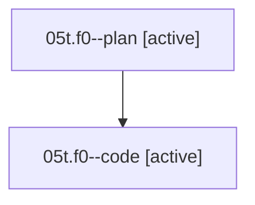

# Family: 05t.f0

[Agent Hoods](../README.md) / [bbugyi200](../users/bbugyi200/README.md) / [athena](../users/bbugyi200/machines/athena/README.md) / [05t](../users/bbugyi200/machines/athena/hoods/05t/README.md) / 05t.f0

Owner: `bbugyi200.athena` · Hood: `05t` · Members: 2

## Lineage

The diagram is an optional enhancement; the ordered table below contains the same lineage in accessible text.

| Role | Agent | State | Model / provider | Timing | Commits | Prompt | Chat |
|---|---|---|---|---|---:|---|---|
| plan | 05t.f0--plan | active | opus / claude | 2026-08-18T13:34:34.819244+00:00 | 0 | [Prompt](../agents/bbugyi200.athena.05t.f0--plan/prompt.md) | [Chat](../agents/bbugyi200.athena.05t.f0--plan/chat.md) |
| code | 05t.f0--code | active | grok-4.6 / grok | 2026-08-18T13:42:05.713204+00:00 | 0 | — | — |

## Neighbors

| Agent | Relation | State |
|---|---|---|
| [05t](../agents/bbugyi200.athena.05t/README.md) | ancestor | completed |
