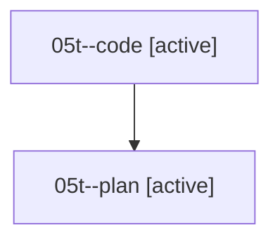

# Family: 05t

[Agent Hoods](../README.md) / [bbugyi200](../users/bbugyi200/README.md) / [athena](../users/bbugyi200/machines/athena/README.md) / [05t](../users/bbugyi200/machines/athena/hoods/05t/README.md) / 05t

Owner: `bbugyi200.athena` · Hood: `05t` · Members: 2

## Lineage

The diagram is an optional enhancement; the ordered table below contains the same lineage in accessible text.

| Role | Agent | State | Model / provider | Timing | Commits | Prompt | Chat |
|---|---|---|---|---|---:|---|---|
| code | 05t--code | active | grok-4.6 / grok | 2026-08-18T11:34:43.721392+00:00 | 0 | — | — |
| plan | 05t--plan | active | opus / claude | 2026-08-18T11:20:51.547125+00:00 | 0 | [Prompt](../agents/bbugyi200.athena.05t--plan/prompt.md) | [Chat](../agents/bbugyi200.athena.05t--plan/chat.md) |

## Commits

| Role | Repo | Commit | Subject | Committed |
|---|---|---|---|---|
| — | sase | [`008972d`](https://github.com/sase-org/sase/commit/008972df48a2c59ed6c4c3d2da640303d72391c9) | feat(ace): revert agent changes across linked repos | 2026-06-25 07:54:22 EDT |
