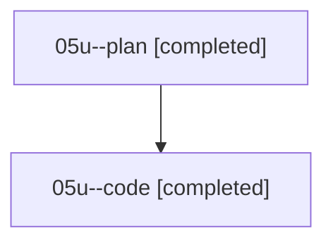

# Family: 05u

[Agent Hoods](../README.md) / [bbugyi200](../users/bbugyi200/README.md) / [athena](../users/bbugyi200/machines/athena/README.md) / [05u](../users/bbugyi200/machines/athena/hoods/05u/README.md) / 05u

Owner: `bbugyi200.athena` · Hood: `05u` · Members: 2

## Lineage

The diagram is an optional enhancement; the ordered table below contains the same lineage in accessible text.

| Role | Agent | State | Model / provider | Timing | Commits | Prompt | Chat |
|---|---|---|---|---|---:|---|---|
| plan | 05u--plan | completed | opus / claude | 2026-08-18T11:24:26.923135+00:00 | 0 | [Prompt](../agents/bbugyi200.athena.05u--plan/prompt.md) | [Chat](../agents/bbugyi200.athena.05u--plan/chat.md) |
| code | 05u--code | completed | sonnet / claude | 2026-08-18T11:43:54.127103+00:00 | [1](../agents/bbugyi200.athena.05u--code/README.md#commits) | — | [Chat](../agents/bbugyi200.athena.05u--code/chat.md) |

## Commits

| Role | Repo | Commit | Subject | Committed |
|---|---|---|---|---|
| code | sase | [`46308f9`](https://github.com/sase-org/sase/commit/46308f980737652aebeb98336ac7ab34c6edd9d3) | fix(grok): auto-disable grok on Grok Build's paid usage-balance failure | 2026-08-18 08:57:40 EDT |
