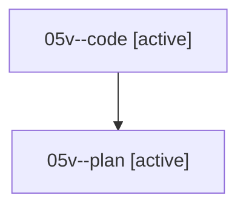

# Family: 05v

[Agent Hoods](../README.md) / [bbugyi200](../users/bbugyi200/README.md) / [athena](../users/bbugyi200/machines/athena/README.md) / [05v](../users/bbugyi200/machines/athena/hoods/05v/README.md) / 05v

Owner: `bbugyi200.athena` · Hood: `05v` · Members: 2

## Lineage

The diagram is an optional enhancement; the ordered table below contains the same lineage in accessible text.

| Role | Agent | State | Model / provider | Timing | Commits | Prompt | Chat |
|---|---|---|---|---|---:|---|---|
| code | 05v--code | active | grok-4.6 / grok | 2026-08-18T11:33:57.117894+00:00 | 0 | — | — |
| plan | 05v--plan | active | opus / claude | 2026-08-18T11:28:32.087276+00:00 | 0 | [Prompt](../agents/bbugyi200.athena.05v--plan/prompt.md) | [Chat](../agents/bbugyi200.athena.05v--plan/chat.md) |
