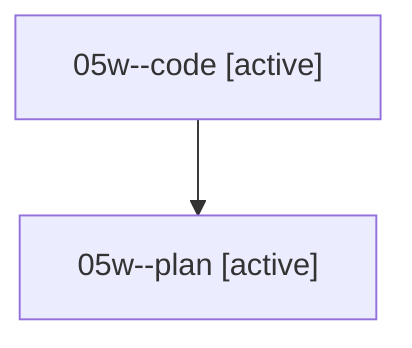

# Family: 05w

[Agent Hoods](../README.md) / [bbugyi200](../users/bbugyi200/README.md) / [athena](../users/bbugyi200/machines/athena/README.md) / [05w](../users/bbugyi200/machines/athena/hoods/05w/README.md) / 05w

Owner: `bbugyi200.athena` · Hood: `05w` · Members: 2

## Lineage

The diagram is an optional enhancement; the ordered table below contains the same lineage in accessible text.

| Role | Agent | State | Model / provider | Timing | Commits | Prompt | Chat |
|---|---|---|---|---|---:|---|---|
| code | 05w--code | active | grok-4.6 / grok | 2026-08-18T11:54:09.700434+00:00 | 0 | — | — |
| plan | 05w--plan | active | opus / claude | 2026-08-18T11:43:35.998593+00:00 | 0 | [Prompt](../agents/bbugyi200.athena.05w--plan/prompt.md) | [Chat](../agents/bbugyi200.athena.05w--plan/chat.md) |

## Commits

| Role | Repo | Commit | Subject | Committed |
|---|---|---|---|---|
| — | sase | [`c297507`](https://github.com/sase-org/sase/commit/c2975075b0626698b2fbfb038317b892f6e42b63) | chore: Add SDD prompt and plan for wait\_directive\_canonical\_duration | 2026-06-25 08:00:48 EDT |
| — | sase | [`bb04443`](https://github.com/sase-org/sase/commit/bb0444316c01c8beae8365a4fb98be68e65091cf) | fix(xprompt): disambiguate leading-zero wait names | 2026-06-25 08:11:39 EDT |
