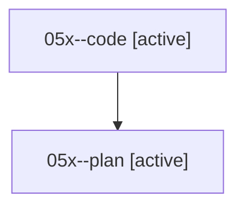

# Family: 05x

[Agent Hoods](../README.md) / [bbugyi200](../users/bbugyi200/README.md) / [athena](../users/bbugyi200/machines/athena/README.md) / [05x](../users/bbugyi200/machines/athena/hoods/05x/README.md) / 05x

Owner: `bbugyi200.athena` · Hood: `05x` · Members: 2

## Lineage

The diagram is an optional enhancement; the ordered table below contains the same lineage in accessible text.

| Role | Agent | State | Model / provider | Timing | Commits | Prompt | Chat |
|---|---|---|---|---|---:|---|---|
| code | 05x--code | active | gemini-3.7-flash-high / agy | 2026-08-18T12:03:10.770857+00:00 | [1](../agents/bbugyi200.athena.05x--code/README.md#commits) | — | — |
| plan | 05x--plan | active | opus / claude | 2026-08-18T11:59:35.678413+00:00 | 0 | [Prompt](../agents/bbugyi200.athena.05x--plan/prompt.md) | [Chat](../agents/bbugyi200.athena.05x--plan/chat.md) |

## Commits

| Role | Repo | Commit | Subject | Committed |
|---|---|---|---|---|
| — | sase | [`8428b79`](https://github.com/sase-org/sase/commit/8428b7962fe6346ab31a7712c391025641a1ee9e) | feat: save prompt drafts as xprompts | 2026-06-25 08:27:46 EDT |
| code | sase | [`27033f3`](https://github.com/sase-org/sase/commit/27033f367a371a4d6b6003d01f8b4b0c6c9025ce) | docs(readme): drop explicit-only qualifier from agent status cells | 2026-08-18 08:12:48 EDT |

## Neighbors

| Agent | Relation | State |
|---|---|---|
| [05x.f1](../agents/bbugyi200.athena.05x.f1/README.md) | descendant | completed |
| [05x.f2](../agents/bbugyi200.athena.05x.f2/README.md) | descendant | completed |
