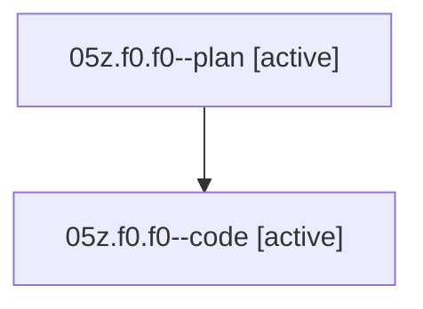

# Family: 05z.f0.f0

[Agent Hoods](../README.md) / [bbugyi200](../users/bbugyi200/README.md) / [athena](../users/bbugyi200/machines/athena/README.md) / [05z](../users/bbugyi200/machines/athena/hoods/05z/README.md) / 05z.f0.f0

Owner: `bbugyi200.athena` · Hood: `05z` · Members: 2

## Lineage

The diagram is an optional enhancement; the ordered table below contains the same lineage in accessible text.

| Role | Agent | State | Model / provider | Timing | Commits | Prompt | Chat |
|---|---|---|---|---|---:|---|---|
| plan | 05z.f0.f0--plan | active | opus / claude | 2026-08-18T14:22:25.886103+00:00 | 0 | [Prompt](../agents/bbugyi200.athena.05z.f0.f0--plan/prompt.md) | [Chat](../agents/bbugyi200.athena.05z.f0.f0--plan/chat.md) |
| code | 05z.f0.f0--code | active | grok-4.6 / grok | 2026-08-18T14:42:06.005576+00:00 | 0 | — | — |

## Neighbors

| Agent | Relation | State |
|---|---|---|
| [05z.f0](../agents/bbugyi200.athena.05z.f0/README.md) | ancestor | completed |
| [05z](../agents/bbugyi200.athena.05z/README.md) | ancestor | completed |
| [05z.w1](../agents/bbugyi200.athena.05z.w1/README.md) | 05z hood | completed |
| [05z.w1.f1](../agents/bbugyi200.athena.05z.w1.f1/README.md) | 05z hood | completed |
| [05z.w1.f2](../agents/bbugyi200.athena.05z.w1.f2/README.md) | 05z hood | completed |
| [05z.w1.f2.f1](../agents/bbugyi200.athena.05z.w1.f2.f1/README.md) | 05z hood | completed |
