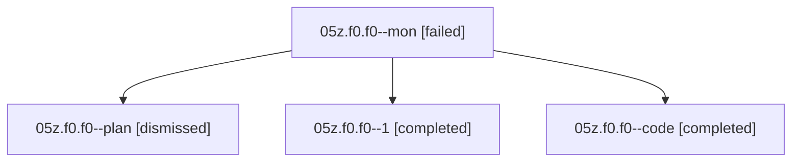

# Family: 05z.f0.f0

[Agent Hoods](../README.md) / [bbugyi200](../users/bbugyi200/README.md) / [athena](../users/bbugyi200/machines/athena/README.md) / [05z](../users/bbugyi200/machines/athena/hoods/05z/README.md) / 05z.f0.f0

Owner: `bbugyi200.athena` · Hood: `05z` · Members: 4

## Lineage

The diagram is an optional enhancement; the ordered table below contains the same lineage in accessible text.

| Role | Agent | State | Model / provider | Timing | Commits | Prompt | Chat |
|---|---|---|---|---|---:|---|---|
| mon | 05z.f0.f0--mon | failed | grok-4.6 / grok | 2026-08-18T15:03:36.213317+00:00 | 0 | — | [Chat](../agents/bbugyi200.athena.05z.f0.f0--mon/chat.md) |
| plan | 05z.f0.f0--plan | dismissed | — | 2026-08-18T10:22:01 | 0 | — | — |
| 1 | 05z.f0.f0--1 | completed | grok-4.6 / grok | 2026-08-18T15:10:25.936976+00:00 | [1](../agents/bbugyi200.athena.05z.f0.f0--1/README.md#commits) | [Prompt](../agents/bbugyi200.athena.05z.f0.f0--1/prompt.md) | [Chat](../agents/bbugyi200.athena.05z.f0.f0--1/chat.md) |
| code | 05z.f0.f0--code | completed | grok-4.6 / grok | 2026-08-18T14:42:06.005576+00:00 | 0 | — | [Chat](../agents/bbugyi200.athena.05z.f0.f0--code/chat.md) |

## Commits

| Role | Repo | Commit | Subject | Committed |
|---|---|---|---|---|
| 1 | sase | [`9102c9e`](https://github.com/sase-org/sase/commit/9102c9efbaf456724af880c6268225c973e8f5d6) | feat(ace): render monitor phases with amber ⚙ MONITOR | 2026-08-18 15:27:43 UTC |

## Neighbors

| Agent | Relation | State |
|---|---|---|
| [05z.f0](../agents/bbugyi200.athena.05z.f0/README.md) | ancestor | dismissed |
| [05z](../agents/bbugyi200.athena.05z/README.md) | ancestor | completed |
| [05z.w1](../agents/bbugyi200.athena.05z.w1/README.md) | 05z hood | completed |
| [05z.w1.f1](../agents/bbugyi200.athena.05z.w1.f1/README.md) | 05z hood | completed |
| [05z.w1.f2](../agents/bbugyi200.athena.05z.w1.f2/README.md) | 05z hood | completed |
| [05z.w1.f2.f1](../agents/bbugyi200.athena.05z.w1.f2.f1/README.md) | 05z hood | completed |
