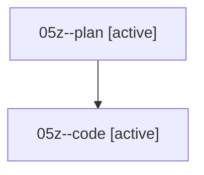

# Family: 05z

[Agent Hoods](../README.md) / [bbugyi200](../users/bbugyi200/README.md) / [athena](../users/bbugyi200/machines/athena/README.md) / [05z](../users/bbugyi200/machines/athena/hoods/05z/README.md) / 05z

Owner: `bbugyi200.athena` · Hood: `05z` · Members: 2

## Lineage

The diagram is an optional enhancement; the ordered table below contains the same lineage in accessible text.

| Role | Agent | State | Model / provider | Timing | Commits | Prompt | Chat |
|---|---|---|---|---|---:|---|---|
| plan | 05z--plan | active | opus / claude | 2026-08-18T12:37:37.102003+00:00 | 0 | [Prompt](../agents/bbugyi200.athena.05z--plan/prompt.md) | [Chat](../agents/bbugyi200.athena.05z--plan/chat.md) |
| code | 05z--code | active | sonnet / claude | 2026-08-18T12:44:50.198713+00:00 | 0 | — | — |

## Commits

| Role | Repo | Commit | Subject | Committed |
|---|---|---|---|---|
| — | sase | [`37163d5`](https://github.com/sase-org/sase/commit/37163d50647f0f67da5831628d3bd8504b73dec1) | chore: Add SDD prompt and plan for fix\_agent\_completion\_text\_muted\_style | 2026-06-25 08:04:39 EDT |
| — | sase | [`092d37c`](https://github.com/sase-org/sase/commit/092d37c365a80e653b5b0937fea0aa753e4ac19e) | fix(tui): use rich parseable agent status fallback | 2026-06-25 08:10:18 EDT |

## Neighbors

| Agent | Relation | State |
|---|---|---|
| [05z.w1](../agents/bbugyi200.athena.05z.w1/README.md) | descendant | completed |
| [05z.w1.f1](../agents/bbugyi200.athena.05z.w1.f1/README.md) | descendant | completed |
| [05z.w1.f2](../agents/bbugyi200.athena.05z.w1.f2/README.md) | descendant | completed |
| [05z.w1.f2.f1](../agents/bbugyi200.athena.05z.w1.f2.f1/README.md) | descendant | completed |
