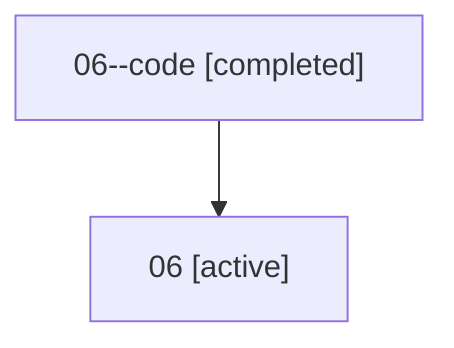

# Family: 06

[Agent Hoods](../README.md) / [bbugyi200](../users/bbugyi200/README.md) / [athena](../users/bbugyi200/machines/athena/README.md) / [06](../users/bbugyi200/machines/athena/hoods/06/README.md) / 06

Owner: `bbugyi200.athena` · Hood: `06` · Members: 2

## Lineage

The diagram is an optional enhancement; the ordered table below contains the same lineage in accessible text.

| Role | Agent | State | Model / provider | Timing | Commits | Prompt | Chat |
|---|---|---|---|---|---:|---|---|
| code | 06--code | completed | gpt-5.5 / codex | 2026-07-07T03:42:43.411584+00:00 | [1](../agents/bbugyi200.athena.06--code/README.md#commits) | — | [Chat](../agents/bbugyi200.athena.06--code/chat.md) |
| root | 06 | active | claude-fable-5 / claude | 2026-07-07T03:30:26.557888+00:00 | [1](../agents/bbugyi200.athena.06/README.md#commits) | [Prompt](../agents/bbugyi200.athena.06/prompt.md) | [Chat](../agents/bbugyi200.athena.06/chat.md) |

## Commits

| Role | Repo | Commit | Subject | Committed |
|---|---|---|---|---|
| — | sase | [`0348a31`](https://github.com/sase-org/sase/commit/0348a311ede448dd40e509994a00bf60fd02258d) | chore: Add SDD prompt and plan for move\_research\_xprompts\_to\_chezmoi | 2026-07-05 07:05:44 EDT |
| — | sase | [`bc6a9cc`](https://github.com/sase-org/sase/commit/bc6a9cc87f2ef91166c3cd4b344f8afc3318f710) | feat!: remove packaged research xprompts | 2026-07-05 07:31:43 EDT |
| root | sase | [`f27dde7`](https://github.com/sase-org/sase/commit/f27dde7d4964dd9da70718efb1decf6a4af08ace) | chore: Add SDD prompt and plan for telegram\_launch\_buttons\_sharded\_artifacts | 2026-07-06 23:42:42 EDT |
| code | sase | [`d7e06b7`](https://github.com/sase-org/sase/commit/d7e06b77b42d89ecf4bb1538c6f89c6fe700124e) | fix: expose launch artifact directories | 2026-07-06 23:54:43 EDT |
