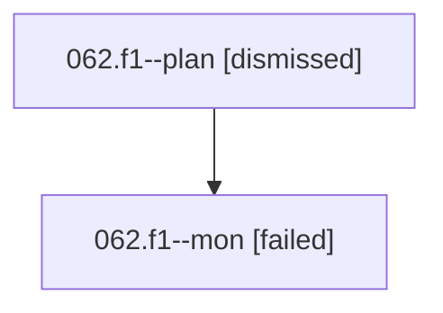

# Family: 062.f1

[Agent Hoods](../README.md) / [bbugyi200](../users/bbugyi200/README.md) / [athena](../users/bbugyi200/machines/athena/README.md) / [062](../users/bbugyi200/machines/athena/hoods/062/README.md) / 062.f1

Owner: `bbugyi200.athena` · Hood: `062` · Members: 2

## Lineage

The diagram is an optional enhancement; the ordered table below contains the same lineage in accessible text.

| Role | Agent | State | Model / provider | Timing | Commits | Prompt | Chat |
|---|---|---|---|---|---:|---|---|
| plan | 062.f1--plan | dismissed | — | 2026-08-18T10:52:35 | 0 | — | — |
| mon | 062.f1--mon | failed | opus / claude | 2026-08-18T15:30:20.101563+00:00 | 0 | — | [Chat](../agents/bbugyi200.athena.062.f1--mon/chat.md) |

## Neighbors

| Agent | Relation | State |
|---|---|---|
| [062](../agents/bbugyi200.athena.062/README.md) | ancestor | completed |
