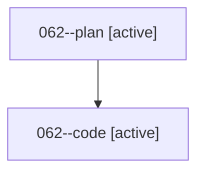

# Family: 062

[Agent Hoods](../README.md) / [bbugyi200](../users/bbugyi200/README.md) / [athena](../users/bbugyi200/machines/athena/README.md) / [062](../users/bbugyi200/machines/athena/hoods/062/README.md) / 062

Owner: `bbugyi200.athena` · Hood: `062` · Members: 2

## Lineage

The diagram is an optional enhancement; the ordered table below contains the same lineage in accessible text.

| Role | Agent | State | Model / provider | Timing | Commits | Prompt | Chat |
|---|---|---|---|---|---:|---|---|
| plan | 062--plan | active | opus / claude | 2026-08-18T13:50:30.271573+00:00 | 0 | [Prompt](../agents/bbugyi200.athena.062--plan/prompt.md) | [Chat](../agents/bbugyi200.athena.062--plan/chat.md) |
| code | 062--code | active | sonnet / claude | 2026-08-18T13:59:06.695946+00:00 | 0 | — | — |

## Commits

| Role | Repo | Commit | Subject | Committed |
|---|---|---|---|---|
| — | sase | [`dc17a19`](https://github.com/sase-org/sase/commit/dc17a19c071a8bc024cb02ae66df57b2082e46ac) | chore: Add SDD prompt and plan for bare\_percent\_directive\_menu | 2026-06-25 13:56:54 EDT |
| — | sase | [`8ebcec3`](https://github.com/sase-org/sase/commit/8ebcec3cadf40ecbd63490fbd247f1513504f3f3) | feat(ace): open directive menu on bare percent | 2026-06-25 14:06:21 EDT |
