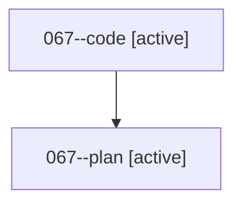

# Family: 067

[Agent Hoods](../README.md) / [bbugyi200](../users/bbugyi200/README.md) / [athena](../users/bbugyi200/machines/athena/README.md) / [067](../users/bbugyi200/machines/athena/hoods/067/README.md) / 067

Owner: `bbugyi200.athena` · Hood: `067` · Members: 2

## Lineage

The diagram is an optional enhancement; the ordered table below contains the same lineage in accessible text.

| Role | Agent | State | Model / provider | Timing | Commits | Prompt | Chat |
|---|---|---|---|---|---:|---|---|
| code | 067--code | active | sonnet / claude | 2026-08-18T14:42:12.574434+00:00 | 0 | — | — |
| plan | 067--plan | active | opus / claude | 2026-08-18T14:31:03.799307+00:00 | 0 | [Prompt](../agents/bbugyi200.athena.067--plan/prompt.md) | [Chat](../agents/bbugyi200.athena.067--plan/chat.md) |
