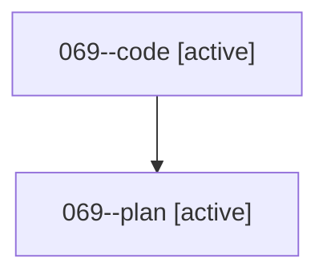

# Family: 069

[Agent Hoods](../README.md) / [bbugyi200](../users/bbugyi200/README.md) / [athena](../users/bbugyi200/machines/athena/README.md) / [069](../users/bbugyi200/machines/athena/hoods/069/README.md) / 069

Owner: `bbugyi200.athena` · Hood: `069` · Members: 2

## Lineage

The diagram is an optional enhancement; the ordered table below contains the same lineage in accessible text.

| Role | Agent | State | Model / provider | Timing | Commits | Prompt | Chat |
|---|---|---|---|---|---:|---|---|
| code | 069--code | active | grok-4.6 / grok | 2026-08-18T14:51:04.703706+00:00 | [1](../agents/bbugyi200.athena.069--code/README.md#commits) | — | — |
| plan | 069--plan | active | opus / claude | 2026-08-18T14:41:52.424680+00:00 | 0 | [Prompt](../agents/bbugyi200.athena.069--plan/prompt.md) | [Chat](../agents/bbugyi200.athena.069--plan/chat.md) |

## Commits

| Role | Repo | Commit | Subject | Committed |
|---|---|---|---|---|
| — | sase | [`ae536e9`](https://github.com/sase-org/sase/commit/ae536e98dcfcef2215dcc77595c4bab61240ed67) | chore: Add SDD prompt and plan for reject\_plan\_command | 2026-06-25 15:01:48 EDT |
| — | sase | [`83f155c`](https://github.com/sase-org/sase/commit/83f155cf162dcd77ad1e530b0d1aa259f3627764) | feat(plan): add \`sase plan reject\` CLI command | 2026-06-25 15:27:15 EDT |
| code | sase | [`88fa6e9`](https://github.com/sase-org/sase/commit/88fa6e9491d45ff2c30f73b941d57ec44da0ddaa) | feat(glossary): fail batched reads all-or-nothing and shrink render bytes | 2026-08-18 11:51:59 EDT |
