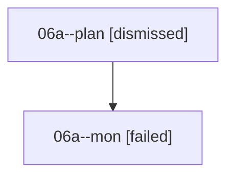

# Family: 06a

[Agent Hoods](../README.md) / [bbugyi200](../users/bbugyi200/README.md) / [athena](../users/bbugyi200/machines/athena/README.md) / [06a](../users/bbugyi200/machines/athena/hoods/06a/README.md) / 06a

Owner: `bbugyi200.athena` · Hood: `06a` · Members: 2

## Lineage

The diagram is an optional enhancement; the ordered table below contains the same lineage in accessible text.

| Role | Agent | State | Model / provider | Timing | Commits | Prompt | Chat |
|---|---|---|---|---|---:|---|---|
| plan | 06a--plan | dismissed | — | 2026-08-18T11:07:25 | 0 | — | — |
| mon | 06a--mon | failed | opus / claude | 2026-08-18T15:25:55.487163+00:00 | 0 | — | [Chat](../agents/bbugyi200.athena.06a--mon/chat.md) |

## Commits

| Role | Repo | Commit | Subject | Committed |
|---|---|---|---|---|
| — | sase | [`03110b4`](https://github.com/sase-org/sase/commit/03110b4ca6a3390fdb1ae22bdaaf689b850433b3) | chore: Add SDD prompt and plan for agent\_prompt\_wrap\_width | 2026-06-25 19:02:19 UTC |
| — | sase | [`b09728a`](https://github.com/sase-org/sase/commit/b09728a8c211caaed28dd06ac2cfebc7f7725454) | feat(llm): wrap agent prompts at 80 columns | 2026-06-25 19:09:52 UTC |
