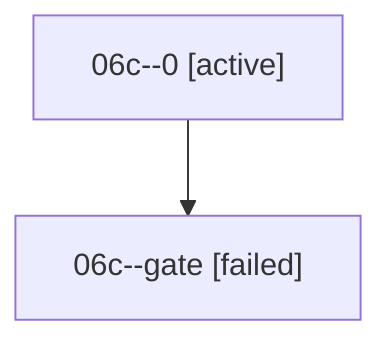

# Family: 06c

[Agent Hoods](../README.md) / [bbugyi200](../users/bbugyi200/README.md) / [athena](../users/bbugyi200/machines/athena/README.md) / [06c](../users/bbugyi200/machines/athena/hoods/06c/README.md) / 06c

Owner: `bbugyi200.athena` · Hood: `06c` · Members: 2

## Lineage

The diagram is an optional enhancement; the ordered table below contains the same lineage in accessible text.

| Role | Agent | State | Model / provider | Timing | Commits | Prompt | Chat |
|---|---|---|---|---|---:|---|---|
| 0 | 06c--0 | active | gpt-5.5 / codex | 2026-09-07T21:29:40.446240+00:00 | [1](../agents/bbugyi200.athena.06c--0/README.md#commits) | [Prompt](../agents/bbugyi200.athena.06c--0/prompt.md) | — |
| gate | 06c--gate | failed | gpt-5.5 / codex | 2026-09-07T21:46:34.461185+00:00 → 2026-09-07T21:46:43.248890+00:00 | 0 | — | [Chat](../agents/bbugyi200.athena.06c--gate/chat.md) |

## Commits

| Role | Repo | Commit | Subject | Committed |
|---|---|---|---|---|
| — | sase | [`58c0805`](https://github.com/sase-org/sase/commit/58c08057b498e207c10eb40a9737eefad39d1fe5) | chore: Add SDD prompt and plan for agents\_tab\_onboarding | 2026-06-25 15:22:15 EDT |
| — | sase | [`af0105b`](https://github.com/sase-org/sase/commit/af0105be98cb39f8f38b2a1108c31e4db6460759) | feat(tui): add agents tab onboarding state | 2026-06-25 15:40:54 EDT |
| 0 | sase | [`c92cee7`](https://github.com/sase-org/sase/commit/c92cee70e18b096734092f67d2e448c7ee2140a7) | fix(pager): satisfy verification lint gates | 2026-09-07 19:20:27 EDT |

## Neighbors

| Agent | Relation | State |
|---|---|---|
| [06c.f1](../agents/bbugyi200.athena.06c.f1/README.md) | descendant | completed |
