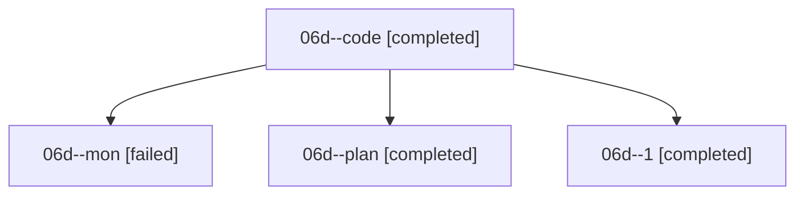

# Family: 06d

[Agent Hoods](../README.md) / [bbugyi200](../users/bbugyi200/README.md) / [athena](../users/bbugyi200/machines/athena/README.md) / [06d](../users/bbugyi200/machines/athena/hoods/06d/README.md) / 06d

Owner: `bbugyi200.athena` · Hood: `06d` · Members: 4

## Lineage

The diagram is an optional enhancement; the ordered table below contains the same lineage in accessible text.

| Role | Agent | State | Model / provider | Timing | Commits | Prompt | Chat |
|---|---|---|---|---|---:|---|---|
| code | 06d--code | completed | grok-4.6 / grok | 2026-08-18T17:07:20.150571+00:00 | 0 | — | [Chat](../agents/bbugyi200.athena.06d--code/chat.md) |
| mon | 06d--mon | failed | grok-4.6 / grok | 2026-08-18T17:44:44.601168+00:00 | 0 | — | [Chat](../agents/bbugyi200.athena.06d--mon/chat.md) |
| plan | 06d--plan | completed | opus / claude | 2026-08-18T16:57:02.610676+00:00 | 0 | [Prompt](../agents/bbugyi200.athena.06d--plan/prompt.md) | [Chat](../agents/bbugyi200.athena.06d--plan/chat.md) |
| 1 | 06d--1 | completed | grok-4.6 / grok | 2026-08-18T17:45:33.670590+00:00 | 0 | [Prompt](../agents/bbugyi200.athena.06d--1/prompt.md) | [Chat](../agents/bbugyi200.athena.06d--1/chat.md) |

## Commits

| Role | Repo | Commit | Subject | Committed |
|---|---|---|---|---|
| — | sase | [`3d7728a`](https://github.com/sase-org/sase/commit/3d7728a5e5d0feef26e8fc459b9130f13335e02b) | chore: Add SDD prompt and plan for telegram\_auto\_plan\_button\_dismissal | 2026-06-25 15:40:35 EDT |
| — | sase | [`02fb83e`](https://github.com/sase-org/sase/commit/02fb83e8928441bef861fdfc40cbde7d35b5388a) | feat(notifications): record handled plan actions in shared store | 2026-06-25 16:11:23 EDT |
| — | sase | [`7714541`](https://github.com/sase-org/sase/commit/771454166ccf429023e15a1351849d6996c23b66) | feat(bead): expand @\<path\> on free-text CLI values | 2026-08-18 13:51:06 EDT |
