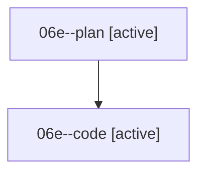

# Family: 06e

[Agent Hoods](../README.md) / [bbugyi200](../users/bbugyi200/README.md) / [athena](../users/bbugyi200/machines/athena/README.md) / [06e](../users/bbugyi200/machines/athena/hoods/06e/README.md) / 06e

Owner: `bbugyi200.athena` · Hood: `06e` · Members: 2

## Lineage

The diagram is an optional enhancement; the ordered table below contains the same lineage in accessible text.

| Role | Agent | State | Model / provider | Timing | Commits | Prompt | Chat |
|---|---|---|---|---|---:|---|---|
| plan | 06e--plan | active | opus / claude | 2026-08-18T17:00:12.716718+00:00 | 0 | [Prompt](../agents/bbugyi200.athena.06e--plan/prompt.md) | [Chat](../agents/bbugyi200.athena.06e--plan/chat.md) |
| code | 06e--code | active | sonnet / claude | 2026-08-18T17:19:19.098786+00:00 | 0 | — | — |

## Commits

| Role | Repo | Commit | Subject | Committed |
|---|---|---|---|---|
| — | sase | [`2579d18`](https://github.com/sase-org/sase/commit/2579d18c554507c1e79bd7bbea32287f1a0e0e2a) | docs: add tiny field note | 2026-06-25 15:43:03 EDT |
