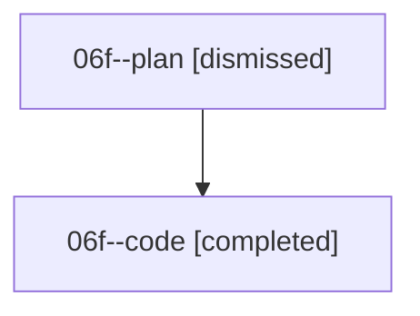

# Family: 06f

[Agent Hoods](../README.md) / [bbugyi200](../users/bbugyi200/README.md) / [athena](../users/bbugyi200/machines/athena/README.md) / [06f](../users/bbugyi200/machines/athena/hoods/06f/README.md) / 06f

Owner: `bbugyi200.athena` · Hood: `06f` · Members: 2

## Lineage

The diagram is an optional enhancement; the ordered table below contains the same lineage in accessible text.

| Role | Agent | State | Model / provider | Timing | Commits | Prompt | Chat |
|---|---|---|---|---|---:|---|---|
| plan | 06f--plan | dismissed | — | 2026-08-18T13:13:52 | 0 | — | — |
| code | 06f--code | completed | grok-4.6 / grok | 2026-08-18T18:24:43.129527+00:00 | [1](../agents/bbugyi200.athena.06f--code/README.md#commits) | — | [Chat](../agents/bbugyi200.athena.06f--code/chat.md) |

## Commits

| Role | Repo | Commit | Subject | Committed |
|---|---|---|---|---|
| code | sase | [`ea31a2b`](https://github.com/sase-org/sase/commit/ea31a2b5bf9cd1a092d55bb90fde6891711be152) | fix(agent): rebuild real identity on kill-and-edit | 2026-08-18 14:59:21 EDT |
