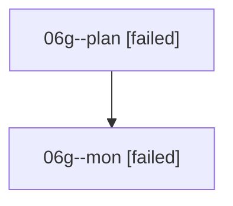

# Family: 06g

[Agent Hoods](../README.md) / [bbugyi200](../users/bbugyi200/README.md) / [athena](../users/bbugyi200/machines/athena/README.md) / [06g](../users/bbugyi200/machines/athena/hoods/06g/README.md) / 06g

Owner: `bbugyi200.athena` · Hood: `06g` · Members: 2

## Lineage

The diagram is an optional enhancement; the ordered table below contains the same lineage in accessible text.

| Role | Agent | State | Model / provider | Timing | Commits | Prompt | Chat |
|---|---|---|---|---|---:|---|---|
| plan | 06g--plan | failed | opus / claude | 2026-08-18T17:23:41.303847+00:00 | 0 | [Prompt](../agents/bbugyi200.athena.06g--plan/prompt.md) | [Chat](../agents/bbugyi200.athena.06g--plan/chat.md) |
| mon | 06g--mon | failed | opus / claude | 2026-08-18T17:44:11.897525+00:00 | 0 | — | [Chat](../agents/bbugyi200.athena.06g--mon/chat.md) |

## Commits

| Role | Repo | Commit | Subject | Committed |
|---|---|---|---|---|
| — | sase | [`7ef9d81`](https://github.com/sase-org/sase/commit/7ef9d812bfbb144e8f8515dcf1258a415b521bf5) | chore: Add SDD prompt and plan for zoom\_panel\_ctrlp\_metadata\_1 | 2026-06-25 20:23:25 UTC |
| — | sase | [`ab5ae80`](https://github.com/sase-org/sase/commit/ab5ae80407c374c3c7c78da8adefe73da7524ee5) | fix(ace): return to metadata on Ctrl-P after zoom file reveal | 2026-06-25 20:29:56 UTC |
