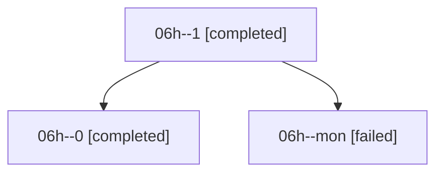

# Family: 06h

[Agent Hoods](../README.md) / [bbugyi200](../users/bbugyi200/README.md) / [athena](../users/bbugyi200/machines/athena/README.md) / [06h](../users/bbugyi200/machines/athena/hoods/06h/README.md) / 06h

Owner: `bbugyi200.athena` · Hood: `06h` · Members: 3

## Lineage

The diagram is an optional enhancement; the ordered table below contains the same lineage in accessible text.

| Role | Agent | State | Model / provider | Timing | Commits | Prompt | Chat |
|---|---|---|---|---|---:|---|---|
| 1 | 06h--1 | completed | grok-4.6 / grok | 2026-08-18T17:39:47.679976+00:00 | [1](../agents/bbugyi200.athena.06h--1/README.md#commits) | [Prompt](../agents/bbugyi200.athena.06h--1/prompt.md) | [Chat](../agents/bbugyi200.athena.06h--1/chat.md) |
| 0 | 06h--0 | completed | grok-4.6 / grok | 2026-08-18T17:24:30.966741+00:00 | 0 | [Prompt](../agents/bbugyi200.athena.06h--0/prompt.md) | [Chat](../agents/bbugyi200.athena.06h--0/chat.md) |
| mon | 06h--mon | failed | grok-4.6 / grok | 2026-08-18T17:39:14.978179+00:00 | 0 | — | [Chat](../agents/bbugyi200.athena.06h--mon/chat.md) |

## Commits

| Role | Repo | Commit | Subject | Committed |
|---|---|---|---|---|
| — | sase | [`d309209`](https://github.com/sase-org/sase/commit/d3092097634024e4d000201137a1aedfd918d742) | feat(tui): persist agent directive edits in background | 2026-06-25 17:00:03 EDT |
| 1 | sase | [`e5a180d`](https://github.com/sase-org/sase/commit/e5a180de3a0f5260063c789518721968731b457b) | feat(tui): hide empty Beads detail property rows | 2026-08-18 13:41:28 EDT |
