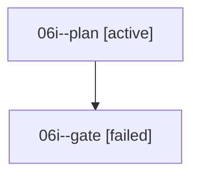

# Family: 06i

[Agent Hoods](../README.md) / [bbugyi200](../users/bbugyi200/README.md) / [athena](../users/bbugyi200/machines/athena/README.md) / [06i](../users/bbugyi200/machines/athena/hoods/06i/README.md) / 06i

Owner: `bbugyi200.athena` · Hood: `06i` · Members: 2

## Lineage

The diagram is an optional enhancement; the ordered table below contains the same lineage in accessible text.

| Role | Agent | State | Model / provider | Timing | Commits | Prompt | Chat |
|---|---|---|---|---|---:|---|---|
| plan | 06i--plan | active | opus / claude | 2026-09-07T21:36:22.492653+00:00 | 0 | [Prompt](../agents/bbugyi200.athena.06i--plan/prompt.md) | [Chat](../agents/bbugyi200.athena.06i--plan/chat.md) |
| gate | 06i--gate | failed | opus / claude | 2026-09-07T22:33:59.341333+00:00 → 2026-09-07T22:36:12.228924+00:00 | 0 | — | [Chat](../agents/bbugyi200.athena.06i--gate/chat.md) |

## Commits

| Role | Repo | Commit | Subject | Committed |
|---|---|---|---|---|
| — | sase | [`f68c362`](https://github.com/sase-org/sase/commit/f68c362c78a4f7f4e28b2a25a7be9b358708fe5a) | chore: Add SDD prompt and plan for claimed\_agent\_reverts\_1 | 2026-06-25 16:57:38 EDT |
| — | sase | [`5fd8741`](https://github.com/sase-org/sase/commit/5fd874121bef6eb10c9110def7d44b2a0bd2ae16) | feat(ace): claim fresh workspaces for agent reverts | 2026-06-25 17:20:56 EDT |

## Neighbors

| Agent | Relation | State |
|---|---|---|
| [06i.f1](../agents/bbugyi200.athena.06i.f1/README.md) | descendant | completed |
| [06i.f2](../agents/bbugyi200.athena.06i.f2/README.md) | descendant | completed |
