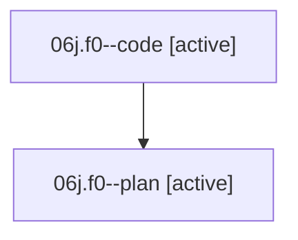

# Family: 06j.f0

[Agent Hoods](../README.md) / [bbugyi200](../users/bbugyi200/README.md) / [athena](../users/bbugyi200/machines/athena/README.md) / [06j](../users/bbugyi200/machines/athena/hoods/06j/README.md) / 06j.f0

Owner: `bbugyi200.athena` · Hood: `06j` · Members: 2

## Lineage

The diagram is an optional enhancement; the ordered table below contains the same lineage in accessible text.

| Role | Agent | State | Model / provider | Timing | Commits | Prompt | Chat |
|---|---|---|---|---|---:|---|---|
| code | 06j.f0--code | active | sonnet / claude | 2026-08-18T19:47:23.765555+00:00 | 0 | — | — |
| plan | 06j.f0--plan | active | opus / claude | 2026-08-18T19:37:17.168539+00:00 | 0 | [Prompt](../agents/bbugyi200.athena.06j.f0--plan/prompt.md) | [Chat](../agents/bbugyi200.athena.06j.f0--plan/chat.md) |

## Neighbors

| Agent | Relation | State |
|---|---|---|
| [06j](../agents/bbugyi200.athena.06j/README.md) | ancestor | completed |
