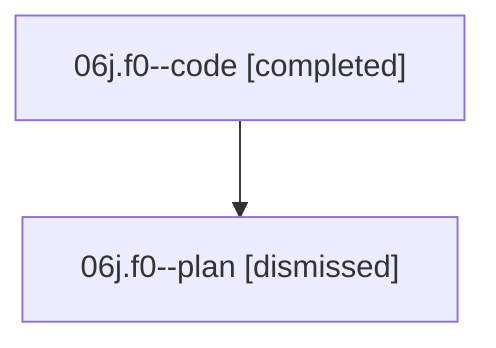

# Family: 06j.f0

[Agent Hoods](../README.md) / [bbugyi200](../users/bbugyi200/README.md) / [athena](../users/bbugyi200/machines/athena/README.md) / [06j](../users/bbugyi200/machines/athena/hoods/06j/README.md) / 06j.f0

Owner: `bbugyi200.athena` · Hood: `06j` · Members: 2

## Lineage

The diagram is an optional enhancement; the ordered table below contains the same lineage in accessible text.

| Role | Agent | State | Model / provider | Timing | Commits | Prompt | Chat |
|---|---|---|---|---|---:|---|---|
| code | 06j.f0--code | completed | sonnet / claude | 2026-08-18T19:47:23.765555+00:00 | [2](../agents/bbugyi200.athena.06j.f0--code/README.md#commits) | — | [Chat](../agents/bbugyi200.athena.06j.f0--code/chat.md) |
| plan | 06j.f0--plan | dismissed | — | 2026-08-18T14:17:33 | 0 | — | — |

## Commits

| Role | Repo | Commit | Subject | Committed |
|---|---|---|---|---|
| code | sase | [`a3765f8`](https://github.com/sase-org/sase/commit/a3765f8570ddafc75ac17745dde7c8f737a5b8a0) | fix(lint): drop stale symvision epic-symbol entry and privatize project\_accent\_map | 2026-08-18 20:32:38 UTC |
| code | sase | [`7beaf2a`](https://github.com/sase-org/sase/commit/7beaf2ac768a2398da4457ee0f532dcaf3ddf68f) | feat(ace): render running-monitor gear badge on tribe panel titles | 2026-08-18 20:33:20 UTC |

## Neighbors

| Agent | Relation | State |
|---|---|---|
| [06j](../agents/bbugyi200.athena.06j/README.md) | ancestor | completed |
