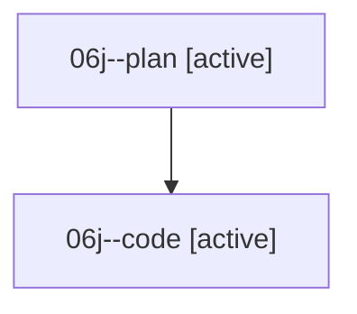

# Family: 06j

[Agent Hoods](../README.md) / [bbugyi200](../users/bbugyi200/README.md) / [athena](../users/bbugyi200/machines/athena/README.md) / [06j](../users/bbugyi200/machines/athena/hoods/06j/README.md) / 06j

Owner: `bbugyi200.athena` · Hood: `06j` · Members: 2

## Lineage

The diagram is an optional enhancement; the ordered table below contains the same lineage in accessible text.

| Role | Agent | State | Model / provider | Timing | Commits | Prompt | Chat |
|---|---|---|---|---|---:|---|---|
| plan | 06j--plan | active | opus / claude | 2026-08-18T17:39:35.853743+00:00 | 0 | [Prompt](../agents/bbugyi200.athena.06j--plan/prompt.md) | [Chat](../agents/bbugyi200.athena.06j--plan/chat.md) |
| code | 06j--code | active | sonnet / claude | 2026-08-18T17:59:55.491952+00:00 | 0 | — | — |

## Commits

| Role | Repo | Commit | Subject | Committed |
|---|---|---|---|---|
| — | sase | [`5d2c42b`](https://github.com/sase-org/sase/commit/5d2c42b7b146547848b10dc8210171340ace9343) | chore: Add SDD prompt and plan for move\_pencil\_after\_runtime | 2026-06-25 17:28:46 EDT |
| — | sase | [`af132fb`](https://github.com/sase-org/sase/commit/af132fb8eb329e27294a9d7c7de9512271924655) | feat(ace): move agent row pencil after runtime suffix | 2026-06-25 17:33:07 EDT |
