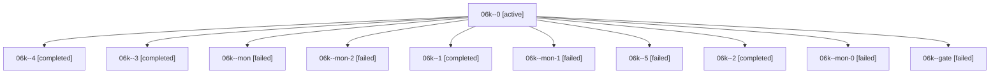

# Family: 06k

[Agent Hoods](../README.md) / [bbugyi200](../users/bbugyi200/README.md) / [athena](../users/bbugyi200/machines/athena/README.md) / [06k](../users/bbugyi200/machines/athena/hoods/06k/README.md) / 06k

Owner: `bbugyi200.athena` · Hood: `06k` · Members: 11

## Lineage

The diagram is an optional enhancement; the ordered table below contains the same lineage in accessible text.

| Role | Agent | State | Model / provider | Timing | Commits | Prompt | Chat |
|---|---|---|---|---|---:|---|---|
| 0 | 06k--0 | active | gpt-6-astra / codex | 2026-09-07T22:18:46.117414+00:00 | 0 | [Prompt](../agents/bbugyi200.athena.06k--0/prompt.md) | [Chat](../agents/bbugyi200.athena.06k--0/chat.md) |
| 4 | 06k--4 | completed | gpt-6-astra / codex | 2026-09-08T00:25:51.106681+00:00 → 2026-09-08T00:34:00.326952+00:00 | 0 | [Prompt](../agents/bbugyi200.athena.06k--4/prompt.md) | [Chat](../agents/bbugyi200.athena.06k--4/chat.md) |
| 3 | 06k--3 | completed | gpt-6-astra / codex | 2026-09-07T23:22:47.636004+00:00 → 2026-09-07T23:27:26.567527+00:00 | 0 | [Prompt](../agents/bbugyi200.athena.06k--3/prompt.md) | [Chat](../agents/bbugyi200.athena.06k--3/chat.md) |
| mon | 06k--mon | failed | gpt-6-astra / codex | 2026-09-07T22:22:49.882500+00:00 → 2026-09-07T22:39:17.355455+00:00 | 0 | — | [Chat](../agents/bbugyi200.athena.06k--mon/chat.md) |
| mon-2 | 06k--mon-2 | failed | gpt-6-astra / codex | 2026-09-07T23:26:58.639319+00:00 → 2026-09-08T00:25:26.904519+00:00 | 0 | — | [Chat](../agents/bbugyi200.athena.06k--mon-2/chat.md) |
| 1 | 06k--1 | completed | gpt-6-astra / codex | 2026-09-07T22:39:45.502923+00:00 → 2026-09-07T22:46:18.565563+00:00 | 0 | [Prompt](../agents/bbugyi200.athena.06k--1/prompt.md) | [Chat](../agents/bbugyi200.athena.06k--1/chat.md) |
| mon-1 | 06k--mon-1 | failed | gpt-6-astra / codex | 2026-09-07T22:55:02.836420+00:00 → 2026-09-07T23:22:20.563839+00:00 | 0 | — | [Chat](../agents/bbugyi200.athena.06k--mon-1/chat.md) |
| 5 | 06k--5 | failed | gpt-6-astra / codex | 2026-09-08T11:03:47.309876+00:00 → 2026-09-08T11:10:29.438677+00:00 | 0 | [Prompt](../agents/bbugyi200.athena.06k--5/prompt.md) | — |
| 2 | 06k--2 | completed | gpt-6-astra / codex | 2026-09-07T22:52:04.207087+00:00 → 2026-09-07T22:55:46.390602+00:00 | 0 | [Prompt](../agents/bbugyi200.athena.06k--2/prompt.md) | [Chat](../agents/bbugyi200.athena.06k--2/chat.md) |
| mon-0 | 06k--mon-0 | failed | gpt-6-astra / codex | 2026-09-07T22:45:30.123207+00:00 → 2026-09-07T22:51:37.324411+00:00 | 0 | — | [Chat](../agents/bbugyi200.athena.06k--mon-0/chat.md) |
| gate | 06k--gate | failed | gpt-6-astra / codex | 2026-09-08T00:33:47.453976+00:00 → 2026-09-08T11:03:27.812075+00:00 | 0 | — | [Chat](../agents/bbugyi200.athena.06k--gate/chat.md) |

## Commits

| Role | Repo | Commit | Subject | Committed |
|---|---|---|---|---|
| — | sase | [`eb726b1`](https://github.com/sase-org/sase/commit/eb726b14cda60f1edec33d2028197f934f12dbab) | chore: Add SDD prompt and plan for plugin\_catalog | 2026-06-25 18:35:43 EDT |
| — | sase | [`2dbf284`](https://github.com/sase-org/sase/commit/2dbf2848cd6077250e48991ffd2def6b3487df21) | chore(beads): create plugin catalog epic beads | 2026-06-25 18:45:26 EDT |
